# System Architecture Diagrams — IEC 61850 SV / GOOSE Publisher

> Generated from [BACKEND_FILE_REFERENCE.md](BACKEND_FILE_REFERENCE.md).
> Diagrams use **real function names** from the current codebase.
> Preview: open in VS Code Markdown preview (or view on GitHub).

This document covers **two related products** built on the same native engine:

* **Part A** — the `sv-publisher` desktop application (Tauri + WebSocket + C++).
  Diagrams D1–D7.
* **Part B** — the `substation_kit` embeddable library that re-uses the
  publisher's native sources as a standalone static library for an external
  C++ app (e.g. the simulator). Diagrams L1–L4.

The two share the IEC 61850 wire-format core (`SvEncoder`,
`GooseEncoder`, `asn1_ber_encoder`, `PcapTx`, `SvStats`) but have
completely separate runtime infrastructure — see L0 for the shared-vs-
distinct map.

| # | Question | Type | Part |
|---|---|---|---|
| D1 | What are the layers in the publisher app and how do they talk? | system overview | A |
| D2 | What happens at process startup? | sequence | A |
| D3 | What does "Add publisher → Start" do end-to-end? | sequence | A |
| D4 | How does the writer loop turn a config into wire bytes? | data flow | A |
| D5 | How does GOOSE TX (with retransmit ramp) work? | data flow | A |
| D6 | How does GOOSE RX decode and surface frames? | data flow | A |
| D7 | What drives the Statistics panel and FrameViewer? | sequence | A |
| L0 | What does the publisher app share with the library? | shared-source map | B |
| L1 | What's inside `libsubstation_kit.a`? | library layout | B |
| L2 | How does a consumer app integrate the library? | integration / build | B |
| L3 | What's the threading model when using `Engine`? | threading | B |
| L4 | What's the typical usage lifecycle? | sequence | B |

The publisher was migrated to a direct **JS ↔ C++ WebSocket** architecture
modeled on the subscriber. There is **no Tauri command layer, no Rust FFI
shim**; the JS side talks to a C++ WebSocket dispatcher (`PubWsServer.cc`)
embedded in the same process, on `ws://localhost:9100/ws`.

---

## D1 — System overview (three layers, single process)

The publisher runs as **one process** (`sv-publisher`) that hosts three
distinct concerns:

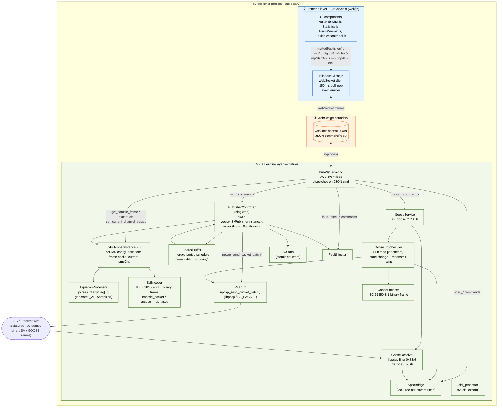

**Reading it:** the JS frontend talks to the C++ engine through one
WebSocket inside the same process — no Tauri IPC, no Rust FFI. Every JS
command is a JSON message on the `/ws` endpoint that `PubWsServer.cc`
dispatches directly to the relevant C++ object. The actual SV / GOOSE
frames on the wire are binary IEC 61850 — JSON is purely the **internal**
control plane.

---

## D2 — Startup sequence

What happens between `./sv-publisher` and the first frame on the wire.

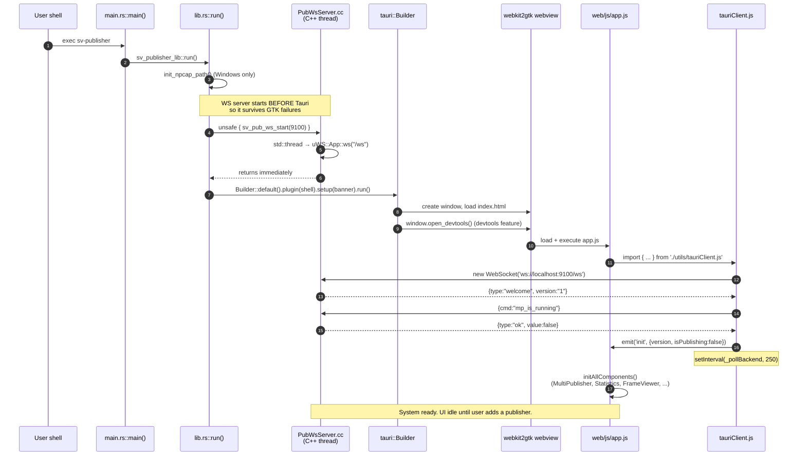

---

## D3 — Add publisher → Start (the primary workflow)

What every "Start All" click triggers, from UI button to wire frame. The
sequence includes the **equation format gotcha** (pipe-delimited, not
JSON — fixed in tauriClient).

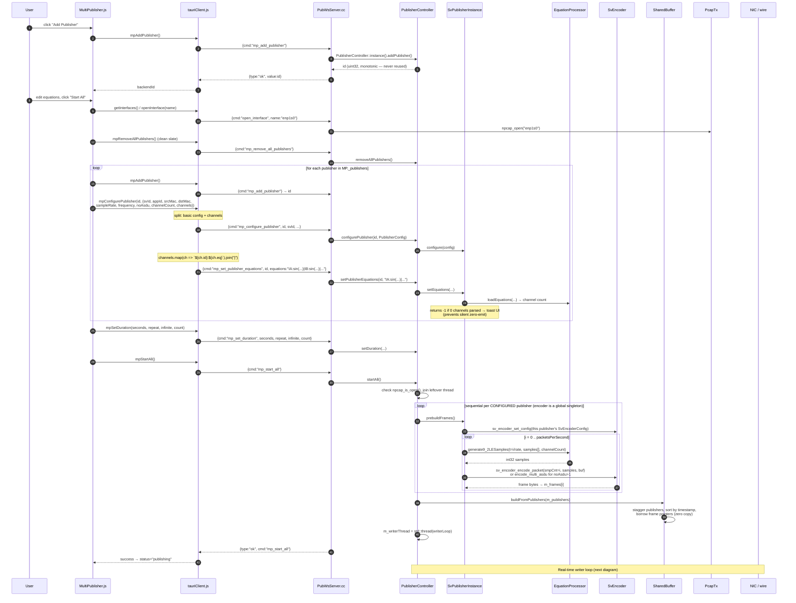

---

## D4 — SV writer loop (config → samples → bytes → wire)

The hot path. One thread inside `PublisherController` strides through the
merged schedule, paces against an absolute deadline, optionally re-encodes
External-source frames live, applies fault injection, and ships via
`PcapTx`. Per-publisher `setCurrentSmpCnt(frameIdx)` lets the FrameViewer
display the live counter.

```mermaid
flowchart TB
    EQS["User equations<br/>'IA:sin(2*PI*50*t)|...'<br/>(or WT:/WTS: wavetables)"]
    EQ["EquationProcessor::loadEquations()<br/>parse once into EqChannelData[]"]
    GEN["generate9_2LESamples(t)<br/>called per frame at prebuild"]
    ENC["SvEncoder::encode_packet()<br/>or encode_multi_asdu()<br/>builds Ethernet+VLAN+SV+ASN.1 BER"]
    CACHE["SvPublisherInstance.m_frames[]<br/>contiguous 1-second cache<br/>≤65536 frames"]
    SB["SharedBuffer<br/>vector&lt;ScheduleEntry&gt;<br/>{timestamp_us, framePtr, frameLen,<br/>publisher*, frameIdx}<br/>sorted, immutable"]

    subgraph LOOP["PublisherController::writerLoop()"]
        direction TB
        TRY{"tryParallelWriterPool()?"}
        WLI["writerLoopImmediate()<br/>(single-thread legacy path)"]
        PACER["sv::DeadlinePacer<br/>clock_nanosleep absolute"]
        WAIT["wait_due(N)"]
        ENTRY["read ScheduleEntry e =<br/>m_sharedBuffer[schedIdx % schedSize]"]
        STAMP["e.publisher->setCurrentSmpCnt(e.frameIdx)<br/>(relaxed atomic, for FrameViewer)"]
        EXT{"e.publisher->sourceMode() == External<br/>&& protocol() == SV?"}
        REENC["e.publisher->reencodeFrame(e.frameIdx, now_ns)<br/>(pulls from SpscBridge.sampleAt())"]
        FIQ{"m_faultInjector.isEnabled()?"}
        FI["m_faultInjector.process(<br/>e.framePtr, e.frameLen, scratch)<br/>→ SEND_NORMAL / DROP / DUP / MODIFIED"]
        SEND["npcap_send_packet_batch(SEND_BATCH=16)"]
        STATS["npcap_stats_record_packet_batch()<br/>(uint64 atomics)"]
        DURATION{"checkDurationElapsed()?"}
        REPEAT{"m_repeatEnabled<br/>&& (infinite || ++cycle &lt; count)?"}
    end

    TX["PcapTx<br/>libpcap pcap_inject() /<br/>AF_PACKET sendmmsg"]
    NIC(["NIC / wire — binary IEC 61850-9-2 LE frame<br/>EtherType 0x88BA"])

    EQS --> EQ --> GEN --> ENC --> CACHE
    CACHE -->|"borrowed framePtr<br/>(SvPublisherInstance.getFrame(i))"| SB
    SB --> TRY
    TRY -->|"deliberately returns false"| WLI
    WLI --> PACER --> WAIT --> ENTRY --> STAMP --> EXT
    EXT -->|"yes"| REENC --> FIQ
    EXT -->|"no"| FIQ
    FIQ -->|"yes"| FI --> SEND
    FIQ -->|"no"| SEND
    SEND --> STATS
    STATS --> DURATION
    DURATION -->|"no"| WAIT
    DURATION -->|"yes"| REPEAT
    REPEAT -->|"yes"| PACER
    REPEAT -->|"no"| DONE(["thread exits → m_running=false<br/>250 ms poller fires 'publishingStopped'"])
    SEND --> TX --> NIC

    classDef hot fill:#fff3e0,stroke:#e65100,color:#000;
    classDef store fill:#e3f2fd,stroke:#1565c0,color:#000;
    class LOOP,PACER,WAIT,ENTRY,STAMP,SEND hot;
    class CACHE,SB store;
```

---

## D5 — GOOSE TX (configure → state change → retransmit ramp)

GOOSE is a separate protocol with its own scheduler thread per stream and
its own retransmit cadence per IEC 61850-8-1. The encoder uses the shared
ASN.1 BER helper. Sample values come from `SpscBridge` (so an external app
can drive boolean state changes via the SPSC path).

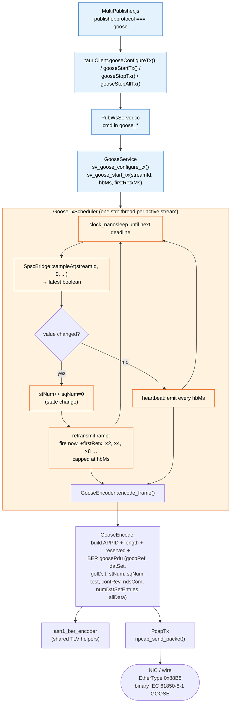

**Retransmit ramp (per IEC 61850-8-1 §A.3):** on a state change the
scheduler emits immediately, then again at `firstRetxMs`, then `×2`, `×4`,
`×8` … capped at `heartbeatMs`. While idle it emits one heartbeat per
`heartbeatMs`. `stNum` increments per state change; `sqNum` per
retransmit within a state.

---

## D6 — GOOSE RX (NIC → decode → SpscBridge)

Inbound GOOSE frames captured from the NIC, decoded, and pushed into the
per-stream outbound ring. Anyone holding the SPSC ring's consumer end
(currently nothing in the publisher binary — exposed for future use) sees
the decoded payload.

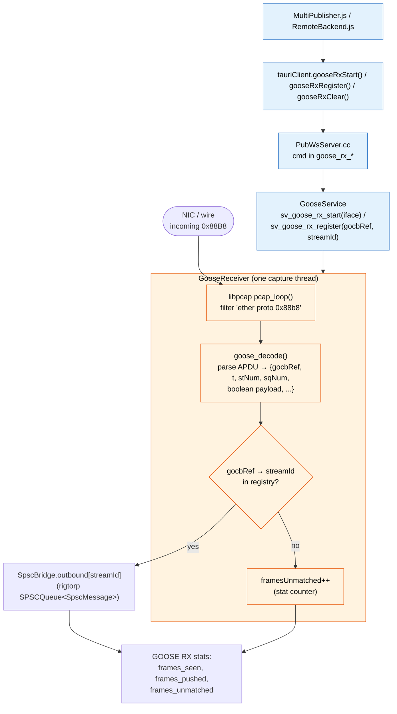

---

## D7 — Statistics + FrameViewer (the 250 ms poll loop)

The Statistics panel and FrameViewer don't push, they pull. tauriClient.js
runs one `setInterval(_pollBackend, 250)` that drives every status,
publishing-edge, stats, and current-channel-values update.

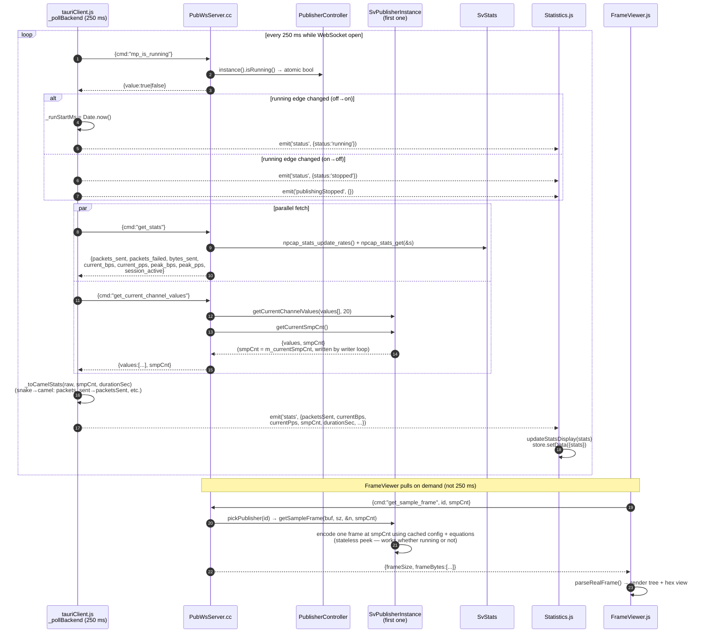

---

## Summary — what's the same / what's different vs. pre-migration

| Concern | Pre-migration | Now |
|---|---|---|
| JS → backend transport | Tauri IPC (`invoke()`) | WebSocket `ws://localhost:9100/ws` |
| Rust command layer | `commands.rs` (~50 handlers) | empty placeholder |
| Rust FFI shim | `ffi.rs` (~30 wrappers) | empty placeholder |
| Single-publisher path | `SvPublisher` singleton + `npcap_publisher_*` C ABI | **deleted** — single-stream is just multi with N=1 |
| Multi-publisher path | `PublisherController` + `SvPublisherInstance × N` | unchanged |
| Stats polling cadence | 250 ms via Tauri | 250 ms via WebSocket |
| FrameViewer inspection | `npcap_get_sample_frame` on legacy singleton | `SvPublisherInstance::getSampleFrame()` per publisher |
| Equation contract | pipe-delimited `"id:eq\|id:eq"` | unchanged (the wire was always this, JS serializer now matches) |
| Wire format | binary IEC 61850-9-2 LE / 8-1 | unchanged |

The simplification: one fewer language hop, one fewer translation layer,
one fewer parallel publisher class. Every diagram above describes the
**current** architecture only — no historical paths shown.

---

# Part B — `substation_kit` (embeddable library)

`substation_kit/` is a **standalone C++ static library** that wraps the
publisher's IEC 61850 wire-format core so an external app (the simulator
running on the same device) can produce SV/GOOSE frames without spinning
up the full publisher application. It is intentionally not linked into
the `sv-publisher` binary — see L0 for the relationship.

Folder: [`substation_kit/`](../../substation_kit/)
Header consumers `#include`: [`include/SubstationKit.h`](../../substation_kit/include/SubstationKit.h)
Public namespace: `substation::`

---

## L0 — Shared vs distinct (publisher app ↔ library)

The two products **share five native source files** (the IEC 61850
encoders, ASN.1 BER helper, libpcap TX wrapper, stats tracker) but have
**completely separate** runtime infrastructure. The library does not
depend on the publisher's WebSocket dispatcher, controller, fault
injector, equation processor, or frontend. The publisher does not
depend on the library.

```mermaid
flowchart TB
    subgraph SHARED["Shared native sources (publisher/custom/native/)"]
        direction TB
        N1["src/SvEncoder.cc + include/sv_encoder.h<br/>(IEC 61850-9-2 LE binary encoder)"]
        N2["src/GooseEncoder.cc + include/GooseEncoder.h<br/>(IEC 61850-8-1 binary encoder)"]
        N3["src/asn1_ber_encoder.cc + include/asn1_ber_encoder.h<br/>(BER TLV primitives)"]
        N4["src/PcapTx.cc + include/PcapTx.h<br/>(libpcap / AF_PACKET raw TX)"]
        N5["src/SvStats.cc + include/sv_stats.h<br/>(atomic counters)"]
    end

    subgraph PUB["sv-publisher binary (Tauri desktop app)"]
        direction TB
        PA["JS frontend (web/js)"]
        PB["PubWsServer.cc<br/>(WS dispatcher)"]
        PC["PublisherController + SvPublisherInstance × N<br/>EquationProcessor, SharedBuffer,<br/>FaultInjector, writer thread, cid_generator"]
        PD["GooseService + GooseTxScheduler + GooseReceiver"]
        PE["SpscBridge"]
    end

    subgraph LIB["libsubstation_kit.a (static archive for external apps)"]
        direction TB
        LA["substation::Engine<br/>(MPMC + worker thread + libpcap)"]
        LB["substation::sv (wraps sv_encoder.h)"]
        LC["substation::goose (wraps GooseEncoder.h)"]
        LD["substation::ber (wraps asn1_ber_encoder.h)"]
        LE["substation::net (wraps PcapTx.h)"]
        LF["substation::spsc::Queue&lt;T&gt;<br/>(rigtorp SPSC wrapper)"]
    end

    PUB ---|"compiled in via src-tauri/build.rs"| SHARED
    LIB ---|"compiled in via substation_kit/CMakeLists.txt"| SHARED
    PC -.uses.-> N1
    PC -.uses.-> N4
    PC -.uses.-> N5
    PD -.uses.-> N2
    PD -.uses.-> N3
    PD -.uses.-> N4
    LB -.wraps.-> N1
    LC -.wraps.-> N2
    LD -.wraps.-> N3
    LE -.wraps.-> N4
    LA -.uses.-> N4
    LA -.uses.-> N5

    PUB_BIN(["sv-publisher (executable)"])
    LIB_BIN(["her_simulator (her executable, links libsubstation_kit.a)"])
    PUB --> PUB_BIN
    LIB --> LIB_BIN

    classDef shared fill:#fff3e0,stroke:#e65100,color:#000;
    classDef pub fill:#e3f2fd,stroke:#1565c0,color:#000;
    classDef lib fill:#f1f8e9,stroke:#33691e,color:#000;
    class SHARED,N1,N2,N3,N4,N5 shared;
    class PUB,PA,PB,PC,PD,PE pub;
    class LIB,LA,LB,LC,LD,LE,LF lib;
```

**Why this split:** the wire-format encoders are pure functions on byte
buffers — perfect to reuse. Everything ABOVE them (UI, scheduling, live
re-encode, fault injection, retransmit ramps) is application-specific
and belongs in whichever app owns the runtime. The simulator gets to
build its own scheduling/UI on top of the same protocol primitives.

---

## L1 — What's inside `libsubstation_kit.a`

Six namespaces under `substation::`, nothing leaks into the consumer's
code. The library is **self-contained** — once linked it pulls in
libpcap + pthread only.

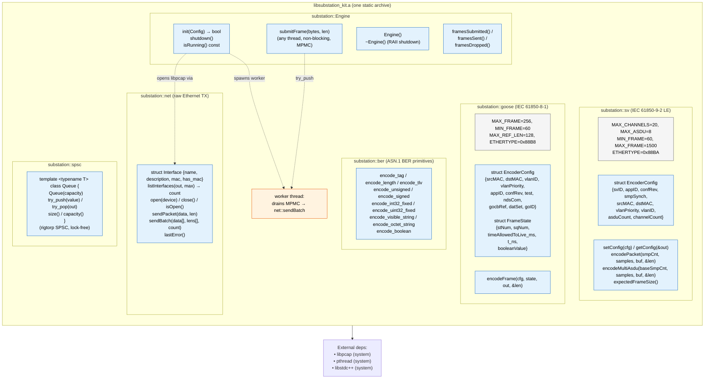

---

## L2 — How a consumer integrates the library

The teammate copies the `substation_kit/` folder into her project, adds
three lines to her CMakeLists.txt, and `#include`s one header. Her
build doesn't see publisher native sources directly — the kit's own
CMake pulls them in.

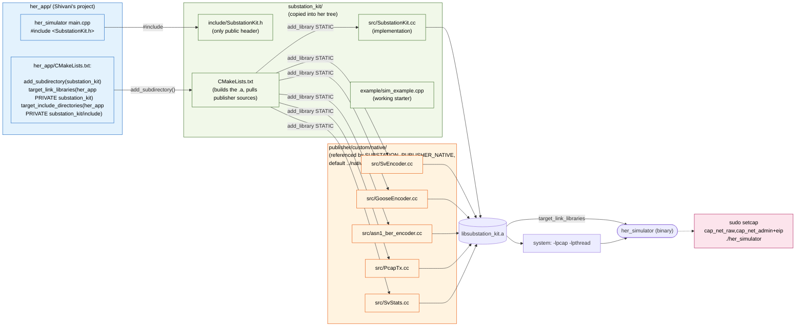

---

## L3 — Threading model when `Engine` is used

Three roles, one queue. `Engine::init()` opens libpcap and spawns one
**engine worker** thread. Any number of her sim worker threads can
encode frames in parallel and push them via `submitFrame()` — the
MPMC queue funnels them to the single TX socket.

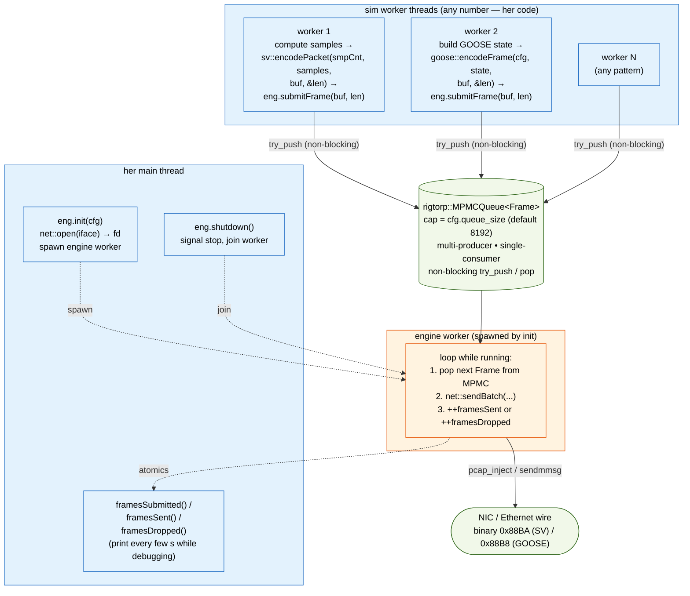

**Threading rules** (from header docstring):

| Call | Thread context |
|---|---|
| `Engine::init` / `shutdown` | Main thread only (one thread, not concurrent) |
| `engine.submitFrame()` | **Any** number of threads (MPMC = multi-producer) |
| `sv::setConfig` | Once per TX context (encoder is a thread-singleton) |
| `sv::encodePacket` / `encodeMultiAsdu` | One thread at a time (after `setConfig`) |
| `goose::encodeFrame` | Thread-safe, stateless |
| `ber::*` | Thread-safe, stateless |
| `net::*` low-level TX | Single handle — use `engine.submitFrame()` instead |
| `spsc::Queue<T>` | One producer + one consumer thread per instance |

---

## L4 — Typical usage lifecycle (one full run)

What her code does in temporal order: configure encoders → init engine
→ hot loop (encode + submit) → shutdown. The engine worker drains in
parallel; she never blocks on the wire.

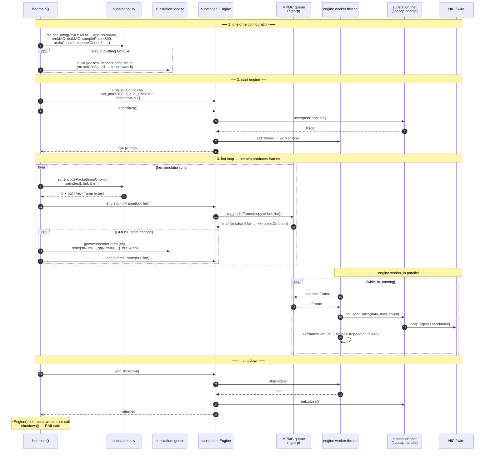

---

## Summary — how the two products relate

| Concern | `sv-publisher` (Part A) | `substation_kit` (Part B) |
|---|---|---|
| Process model | One desktop app (Tauri webview + C++ engine + WS dispatcher) | One static library (`.a`) linked into the consumer's binary |
| Frontend | JavaScript UI, 250 ms WS poll | None — consumer's own code |
| Control plane | `PubWsServer.cc` JSON dispatcher | Direct C++ function calls |
| Multi-stream | `PublisherController` + N `SvPublisherInstance` | Caller decides — typically one `Engine` + N sim worker threads |
| Live data path | `SpscBridge` + `reencodeFrame` for External-source streams | Caller computes samples, calls `sv::encodePacket`, pushes via `submitFrame` |
| GOOSE retransmit ramp | `GooseTxScheduler` (built in) | **Not in the kit** — caller owns timing (use `goose::encodeFrame` + `Engine::submitFrame` themselves) |
| Fault injection | `FaultInjector` in the writer loop | **Not in the kit** |
| Stats | `SvStats` polled via `get_stats` JSON | `engine.framesSubmitted/Sent/Dropped()` direct calls |
| Wire format | Binary IEC 61850-9-2 LE / 8-1 | **Identical** — same encoders, byte-for-byte interoperable |
| TX path | `PcapTx` (libpcap) | `substation::net` (wraps the same `PcapTx`) |
| Capabilities required | `cap_net_admin,cap_net_raw,cap_ipc_lock,cap_sys_nice=eip` | `cap_net_raw,cap_net_admin+eip` (no SCHED_RR / mlockall) |

Both products produce indistinguishable frames on the wire — the
subscriber can decode from either with the same logic. The publisher
app is for the *operator* doing interactive configuration; the library
is for the *simulator* programmatically driving its own scenarios.
