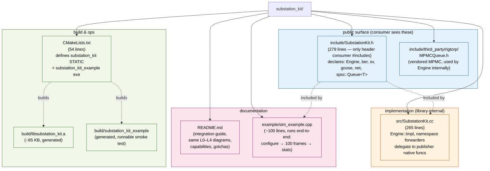
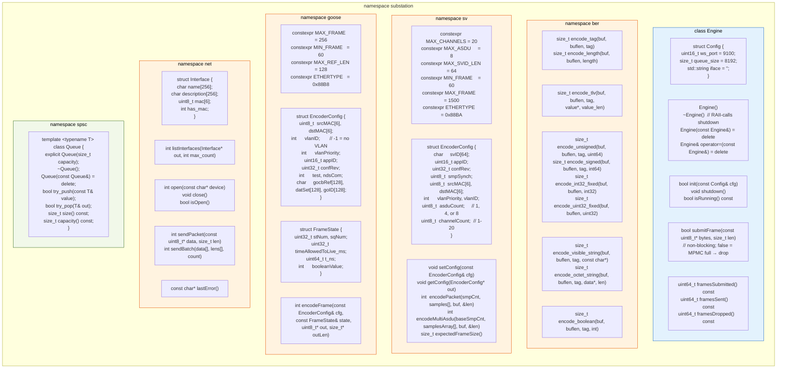
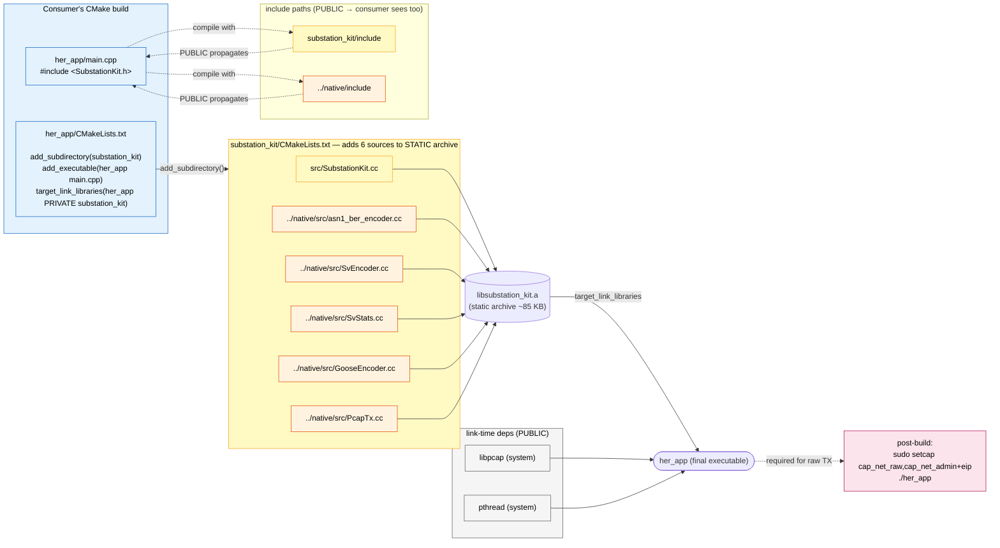
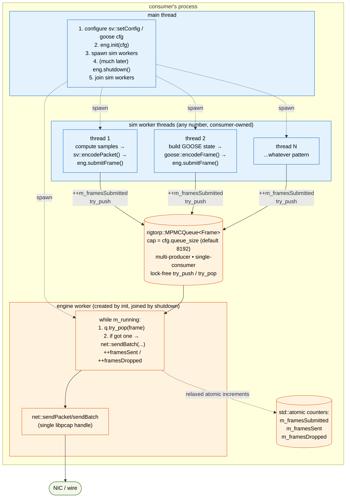

# Backend File Reference — IEC 61850 SV / GOOSE Publisher

> A deep, file-by-file walkthrough of the application backend, written so that a
> reader who has never seen the code can understand the responsibility of every
> file, the important data structures and functions inside it, and how data flows
> between files. This document is the textual companion to the system-architecture
> Mermaid diagrams.
>
> ## Current architecture
>
> The publisher now uses the **same JS ↔ C++ connection pattern as the OOPS subscriber**:
> a single WebSocket on `ws://localhost:9100/ws`, JSON command messages dispatched
> by C++ directly. The previous Tauri/Rust/FFI command bridge has been removed —
> the Rust crate's only job now is to spawn the C++ WebSocket server thread and
> open the Tauri webview window.
>
> Layers:
> 1. **Native C++ engine** (`native/`) — the real-time IEC 61850 Sampled Values
>    and GOOSE publisher: protocol encoding, packet transmission, statistics,
>    fault injection, waveform/equation generation, the in-process SPSC bridge,
>    and (NEW) the WebSocket server that exposes every command directly to JS.
> 2. **Rust / Tauri shell** (`src-tauri/`) — now a thin desktop shell: builds the
>    C++ engine, starts the WebSocket server before the window opens, runs the
>    Tauri webview. `commands.rs` and `ffi.rs` are placeholders post-migration.
> 3. **Embeddable C++ library** (`substation_kit/`, NEW) — repackages the
>    publisher's core capabilities (SV/GOOSE encoders, SPSC, BER, libpcap TX) as
>    a standalone static library + headers for external apps (Shivani's
>    substation simulator) to link directly into their own binaries.
>
> Files are documented in the order they are read.

---

## 1. WebSocket transport layer — Frontend ↔ Backend

This layer is the **publisher's primary IPC surface**. The JavaScript frontend
connects to a single in-process WebSocket on `ws://localhost:9100/ws` and sends
JSON command messages; the C++ side dispatches each command to the appropriate
existing class (`PublisherController`, `GooseService`, `SpscBridge`, etc.) and
sends a JSON reply. This *replaces* the previous Tauri / Rust / FFI command bridge
and is the same pattern used by the OOPS subscriber backend.

The two files form a classic header/implementation pair: the header declares a
single C ABI entry point (so Rust can start the server thread without knowing any
C++ types), and the `.cc` implements the route, the JSON dispatcher, and every
command handler on top of the **uWebSockets** library.

### `native/include/PubWsServer.h`

This header is the **public contract** for starting the publisher's WebSocket
server. It exposes a single `extern "C"` function:

- `int sv_pub_ws_start(uint16_t port)` — start the WS server thread bound to
  `port`. Spawns ONE detached worker thread that owns the uWS event loop. Idempotent
  via a `started` atomic flag — calling twice does nothing the second time.

The endpoint is fixed at `/ws` and the protocol is JSON text frames. Each client
message must include a `"cmd"` field; replies have a `"type"` field
(`welcome` / `ok` / `error` / `event`) and echo the original `cmd` back so the JS
client can correlate request-and-reply by command name.

### `native/src/PubWsServer.cc`

This is the publisher's command dispatcher. It is a direct analog to the
subscriber's `Backend/WsServer.cc` — same uWS library, same single-route +
single-`.message`-lambda pattern, same hand-rolled JSON helpers — and contains
every command handler the publisher needs to expose to the UI.

**Tiny JSON helpers.** Four file-scope helpers do all parsing without pulling in
`nlohmann/json`:
- `json_string(msg, key)` returns a `string_view` to a quoted/unquoted value.
  Critically, it **honors `\X` escape sequences** while scanning for the closing
  quote — required because some payloads (`equations`, `fault_inject_configure`'s
  `config`) carry a stringified JSON document inside a JSON string.
- `json_string_unescaped(msg, key)` returns a fresh `std::string` with `\"`/`\\`/
  `\n`/`\t`/`\r`/`\/` un-escaped — used wherever a nested-JSON field is forwarded
  to a downstream C++ parser (the equation processor, the fault-inject parser).
- `json_number(msg, key)` extracts a number as `double` via `strtod`.
- `json_bool(msg, key)` returns `true` for `"true"`/`"1"`.
- `json_mac(msg, key, out[6])` parses a `[0,1,2,3,4,5]` JSON byte array into a
  6-byte MAC, used for `srcMac` / `dstMac` fields.

**Per-connection state and module singleton.** `PerSocketData` is just an integer
client id. The module singleton (`Module` accessed through `mod()`) holds
`started` (idempotency guard), the detached worker thread, and a mutex protecting
startup. There is no per-client subscription state because the publisher's
WS surface is purely request/reply (the subscriber's was pub/sub for frame
broadcast — different need).

**WS worker — `run_loop(port)`.** Constructs a `uWS::App`, registers one route
`app.ws<PerSocketData>("/ws", { … })` with `compression DISABLED`, a 256 KB max
payload, a 120 s idle timeout, and 16 MB max backpressure. The three handlers:
- **`open`** — assigns an id, prints `[pub-ws] client #N connected`, sends
  `{"type":"welcome","version":"1"}`.
- **`message`** — the dispatcher. After extracting `"cmd"`, it switches through
  every supported command (see catalog below) and uses five local lambdas
  (`reply_ok`, `reply_ok_int`, `reply_ok_uint`, `reply_ok_bool`,
  `reply_error(cmd, reason)`) to standardize the JSON replies.
- **`close`** — prints `[pub-ws] client #N disconnected`.

After registering the route, `app.listen(port, cb)` logs bind success/failure,
then `app.run()` blocks for the lifetime of the process.

**Command catalog (40+ handlers).** Grouped by concern, every handler forwards
to existing C++ logic without owning state of its own:

- **Interface** (`get_interfaces` → `npcap_list_interfaces` + builds JSON array;
  `open_interface` / `close_interface` / `is_interface_open`).
- **Multi-publisher lifecycle** (`mp_add_publisher` / `mp_remove_publisher` /
  `mp_remove_all_publishers` / `mp_get_publisher_count` / `mp_start_all` /
  `mp_stop_all` / `mp_reset_all` / `mp_is_running` / `mp_set_duration` /
  `mp_get_remaining_seconds` / `mp_get_current_repeat_cycle` /
  `mp_is_duration_complete`).
- **Per-publisher config** (`mp_configure_publisher` parses every field of a
  `PublisherConfig` — svID / appID / confRev / smpSynch / src+dst MAC / sampleRate
  / frequency / noAsdu / channelCount — into the C++ struct;
  `mp_set_publisher_equations` accepts the **pipe-delimited** string
  `"id1:eq1|id2:eq2|..."` via `json_string_unescaped` (the format the native
  `eq_load_equations` parser expects — the JS wrapper now builds this format
  explicitly after the WebSocket migration; an earlier
  `JSON.stringify(channels)` payload caused subscribers to see all-zero samples
  because the parser tokenised on `|`, found none, and loaded 0 channels). Forwards
  to `PublisherController::setPublisherEquations`; `mp_set_publisher_source_mode`
  toggles `SourceMode::Equation` ↔ `External`; `mp_set_publisher_protocol` toggles
  `Protocol::SV` ↔ `GOOSE`).
- **Statistics** (`get_stats` returns a `TransmitStats` snapshot as a nested
  `value` object with all the throughput fields the UI Statistics panel renders;
  `reset_stats`; `mp_get_stats` returns the multi-publisher rollup).
- **SPSC bridge** (`spsc_register` / `spsc_unregister` / `spsc_get_stats` — the
  publisher's own SPSC, used by External-source streams).
- **GOOSE TX/RX** (`goose_configure_tx` parses srcMac/dstMac/appID/confRev/test/
  ndsCom + gocbRef/datSet/goId and calls `sv_goose_configure_tx`; `goose_start_tx`
  / `goose_stop_tx` / `goose_stop_all_tx`; `goose_rx_start` / `goose_rx_stop` /
  `goose_rx_register` / `goose_rx_clear`; `goose_get_stats`).
- **Fault injection** (`fault_inject_configure` un-escapes the nested JSON config
  string and forwards to `sv_fault_inject_configure`; `fault_inject_enable` /
  `fault_inject_get_stats` (returns the raw JSON the C++ generates, spliced as a
  nested `value`) / `fault_inject_reset_stats`).
- **Frame inspection** (`get_sample_frame` reads a single SV frame buffer from a
  specific publisher's `SvPublisherInstance::getSampleFrame()`, encodes the bytes
  as a JSON array of integers, and returns `{frameSize, frameBytes}`;
  `get_current_channel_values` returns `{values: [...], smpCnt}` for the
  FrameViewer panel). Both commands take an optional `"id"` field; if missing or
  matching no live publisher, the local `pickPublisher` lambda falls back to
  `PublisherController::getFirstPublisher()` — the lowest live id, **not** id 0 —
  so inspection still works after `removeAllPublishers() + addPublisher()` where
  the new id is never 0.
- **CID export** (`export_cid` uses the same `pickPublisher` fallback and calls
  `pub->exportCid(path)`; `export_cid_with_config` builds a fresh
  `PublisherConfig` from the message fields and calls `sv_cid_export()` directly
  with no publisher needed — the variant the multi-publisher UI uses to emit one
  CID per stream).
- Unknown commands respond `{"type":"error","cmd":"<cmd>","reason":"unknown cmd"}`.

**C ABI implementation.** `sv_pub_ws_start(port)` acquires the start mutex, checks
the `started` atomic, sets it, spawns the worker thread that calls `run_loop(port)`,
and `detach()`es it. There is no stop function — the server runs for the
process's lifetime, mirroring how the subscriber's `sv_service_oops` daemon runs.

**Where it sits in the system.** `PubWsServer` is the *only* path the JavaScript
frontend takes into the C++ backend. JS → uWebSockets → this dispatcher → existing
C++ classes (`PublisherController`, `GooseService`, `SpscBridge`, etc.). The Rust
crate's only job is to call `sv_pub_ws_start(9100)` before opening the Tauri
window; everything else is direct JSON-over-WebSocket.

#### Cross-module call edges (this layer)
- `lib.rs::run() -> sv_pub_ws_start(9100) -> std::thread run_loop(9100)` (started before Tauri's window opens)
- `Frontend tauriClient.js call(cmd, payload) -> ws.send(JSON) -> uWS .message lambda -> dispatch`
- `dispatch [mp_*] -> PublisherController::instance().<method>()`
- `dispatch [mp_configure_publisher] -> configurePublisher(cfg) + (channels)? json_string_unescaped -> setPublisherEquations(json)`
- `dispatch [spsc_*] -> SpscBridge::instance().<method>()`
- `dispatch [goose_*] -> sv_goose_<*> C ABI in GooseService.cc`
- `dispatch [fault_inject_*] -> sv_fault_inject_<*> C ABI`
- `dispatch [interface/get_stats/export_cid/frame inspection] -> npcap_<*> C ABI in PcapTx.cc and SvStats.cc`
- replies sent as `{"type":"ok"|"error", "cmd":"<echo>", "value"?:..., "reason"?:...}` JSON text frames

---

## 2. `native/include/SpscBridge.h` + `native/src/SpscBridge.cc` — lock-free value bridge

`SpscBridge` is the singleton "junction box" that decouples an external data source from the rigid wire-side sample cadence; it owns one **pair of lock-free single-producer/single-consumer (SPSC) ring buffers per logical stream** — an *inbound* ring (teammate/UI → publisher, values to encode) and an *outbound* ring (publisher → teammate, booleans decoded from received GOOSE) — so the publisher can act as a pure translator: callers push plain numbers/booleans and the engine emits IEC 61850-9-2 SV or IEC 61850-8-1 GOOSE, never exposing wire details like `stNum`/`sqNum`. The shared message type is `SpscMessage`, a strict 24-byte POD (guarded by `static_assert(sizeof==24)` for future shared-memory relocation) holding `streamId`, `type` (`SPSC_VALUE_MAGNITUDE=0` for SV / `SPSC_VALUE_BOOLEAN=1` for GOOSE), `channelIndex`, a `union value{float magnitude; uint8_t boolean;}`, `quality` bits, padding, and `timestamp_ns` (0 = stamp at encode). The class exposes lifecycle (`registerStream`/`unregisterStream`/`isRegistered` — lazily allocating a `StreamPair` per stream up to `MAX_STREAMS=256`, each ring `DEFAULT_DEPTH=256`), the inbound producer call `push(msg)` (non-blocking `try_push`; a full ring is counted as a drop), the consumer call `sampleAt(streamId, t_ns, period_ns, out)`, the outbound pair `pushOutbound`/`popOutbound`, and four cheap atomic stat counters. The intelligence lives in `sampleAt()`: it first drains every pending inbound push into a per-stream 256-entry sliding `window` (insertion order = time order), then for magnitudes performs **boxcar decimation** — averaging all samples whose timestamps fall in the centred window `[t_ns − period/2, t_ns + period/2]` (the normal M:N downsampling path, naturally anti-aliasing), falling back to **linear interpolation** between the surrounding two samples when the window is empty, or **holding** the latest value when only one neighbour exists; booleans skip averaging and return the latest latched value. Thread-safety relies entirely on the SPSC contract (exactly one producer thread and one consumer thread per stream/direction — no mutexes anywhere), and the per-stream window/cache is touched only by the single publisher-side consumer. A C ABI (`sv_spsc_register/unregister/push/pop_outbound/get_stats`) mirrors the methods onto the singleton with the `0=ok/-1=error` convention so external callers can drive the data plane. Inbound-ring producers are whoever the embedding application puts in front of `SpscBridge::push()` — in the current `sv-publisher` binary that is the `spsc_*` WebSocket command family in `PubWsServer.cc` (Section 1); in the `substation_kit` library (Section 25) the consuming application calls it directly. The inbound consumer is always the SV/GOOSE encode loop via `sampleAt()`. The outbound ring's producer is the `GooseReceiver` (`pushOutbound`); the publisher binary no longer ships a wire-side RX broadcaster (the legacy `SpscWsServer` was deleted), so the outbound consumer is also application-defined — typically external code that registers a stream and polls `popOutbound()`.

#### Cross-module call edges
- `PubWsServer.cc (spsc_register/unregister/get_stats commands) -> SpscBridge::instance().<method>`
- `SV/GOOSE encode loop -> SpscBridge::sampleAt(streamId, t_ns, period_ns) -> drain StreamPair.inbound -> boxcar/interp/hold`
- `GooseReceiver -> SpscBridge::pushOutbound() -> StreamPair.outbound.try_push()`
- `external app (any consumer of the outbound ring) -> SpscBridge::popOutbound() -> StreamPair.outbound.front()/pop()`
- `external C ABI (sv_spsc_register/unregister/push/pop_outbound/get_stats) -> SpscBridge::instance().<method>` (used by `substation_kit` and any other native consumer)

---

## 3. `native/include/third_party/rigtorp/SPSCQueue.h` — wait-free ring buffer (vendored)

This is Erik Rigtorp's MIT-licensed header-only `rigtorp::SPSCQueue<T, Allocator>`, vendored unchanged as the single concurrency primitive the whole backend's data plane is built on; `SpscBridge` instantiates two of these (`inbound` + `outbound`) per stream and nothing in the codebase rolls its own lock-free queue. It is a **bounded, wait-free, single-producer/single-consumer ring buffer** implemented as a contiguous slot array of `capacity_+1` elements (one slack slot lets the implementation distinguish "full" from "empty" using only the two indices, never a separate count), allocated via the supplied allocator with `kPadding` extra slots on each side so the live data never shares a cache line with neighbouring allocations. Correctness and speed come from careful memory ordering and cache-line discipline: the producer owns `writeIdx_` and the consumer owns `readIdx_`, each `alignas(kCacheLineSize)` (64 B, or `hardware_destructive_interference_size`) so the two hot atomics sit on **separate cache lines to avoid false sharing**; in addition each side keeps a *plain* (non-atomic) cached copy of the other's index — `readIdxCache_` / `writeIdxCache_` — and only reloads the real atomic (an `acquire` load that costs cache-coherency traffic) when its cache says the queue looks full/empty, which is the key trick that keeps the steady-state hot path free of cross-core synchronization. The producer API is `emplace`/`push` (blocking-spin until space — used nowhere critical here) and the `RIGTORP_NODISCARD try_emplace`/`try_push` (non-blocking; returns `false` when the next write index would collide with the read index, i.e. ring full) — this is exactly the call `SpscBridge::push`/`pushOutbound` rely on to treat fullness as a drop. The consumer API is the two-step `front()` (returns a `T*` to the head element or `nullptr` if empty — uses `acquire` to see the producer's latest write) followed by `pop()` (destroys the consumed element and advances `readIdx_` with a `release` store); `SpscBridge::sampleAt` and `popOutbound` use precisely this `front()`/`pop()` pattern. Writes publish with `memory_order_release` and reads observe with `memory_order_acquire`, which is what makes a value pushed on the WebSocket thread safely visible to the encode-loop thread without any mutex. Helper queries `size()`, `empty()`, and `capacity()` (which reports the usable capacity, hiding the slack slot) round out the interface; the type is non-copyable/non-movable, and `static_assert`s enforce the cache-line alignment invariants at compile time. In this system its single role is to be the thread-safe hand-off between the WebSocket/teammate side and the publisher encode/receive side — every cross-thread value transfer in the data plane passes through one of these queues.

#### Cross-module call edges
- `SpscBridge::StreamPair { rigtorp::SPSCQueue<SpscMessage> inbound; outbound; }` (owns 2 per stream)
- `SpscBridge::push()/pushOutbound() -> SPSCQueue::try_push()` (non-blocking enqueue, full → drop)
- `SpscBridge::sampleAt()/popOutbound() -> SPSCQueue::front() then SPSCQueue::pop()` (peek + dequeue)
- memory model: producer `release` store on `writeIdx_` ⇄ consumer `acquire` load — the cross-thread visibility guarantee

---

## 4. `native/include/SharedBuffer.h` + `native/src/SharedBuffer.cc` — merged interleaved transmit schedule

`SharedBuffer` is the multi-publisher SV hot-path data structure: it merges every publisher's individually pre-built frame cache into a **single timestamp-ordered playback schedule** that the writer pool strides through, and despite the name it is *not* a ring buffer or a queue — it is an immutable, sorted `std::vector<ScheduleEntry>` built once at start and never mutated while the writer runs. Each `ScheduleEntry` is a small POD holding `timestamp_us` (when to transmit, relative to cycle start), a **borrowed** `uint8_t* framePtr` pointing directly into the owning publisher's frame cache (zero-copy — so publishers must outlive the SharedBuffer), `frameLen`, the `publisherId`, the `frameIdx` within the owner's cache (needed because live re-encode must recompute `smpCnt` from it), and a cached `SvPublisherInstance* publisher` for O(1) owner dispatch in the tight writer loop. The single interesting method, `buildFromPublishers()`, first scans all publishers and counts only those in the `READY` state plus their total frame count (bailing out with a log message if none are ready), reserves the schedule, then **staggers the publishers evenly across time** so the merged stream doesn't bunch up: it finds the shortest per-publisher interval `minInterval_us = 1e6/pps` and sets `staggerStep = minInterval_us / readyCount`, giving publisher *k* a starting `offset_us = k * staggerStep` (e.g. two 250 µs streams interleave at t=0, 125, 250, 375 µs…). For each ready publisher it emits one `ScheduleEntry` per cached frame at `offset_us + i * interval_us`, borrowing the frame pointer/length via `getFrame(i)`/`getFrameLen(i)`, and tracks `m_cycleDuration_us` as the furthest-out slot plus one interval (the playback end, used by the writer to know when one cycle repeats). Finally it `std::sort`s the whole timeline by `timestamp_us`, tie-breaking by `publisherId` for deterministic ordering. The read-only accessors (`size`, `empty`, `operator[]`, `data`, `getCycleDuration`) let the `PublisherController` writer threads walk the array lock-free — concurrency safety on the SV hot path comes entirely from this array being immutable and read-only during transmission, not from any lock or queue. `clear()` drops the schedule and releases the borrowed pointers. The header comment explicitly frames this as the local stand-in for a future Boost.Interprocess `SharedRingBuffer`. In the system it sits squarely between the publishers' prebuilt caches (its inputs) and the writer pool (its consumer); it is owned by and built from `PublisherController`.

#### Cross-module call edges
- `PublisherController::start() -> SharedBuffer::buildFromPublishers(m_publishers)`
- `SharedBuffer::buildFromPublishers() -> SvPublisherInstance::getState()/getFrameCount()/getPacketsPerSec()/getFrame(i)/getFrameLen(i)/getId()` (borrows pointers, zero-copy)
- `PublisherController writer pool -> SharedBuffer::operator[]/data()/size()/getCycleDuration()` (lock-free read of the immutable schedule)
- `PublisherController::stop()/reset -> SharedBuffer::clear()`

---

## 5. `native/include/sv_publisher_instance.h` + `native/src/sv_publisher_instance.cc` — one SV Merging Unit

`SvPublisherInstance` models a single simulated IEC 61850 Merging Unit and is the unit the `PublisherController` creates many of; each instance owns its own `PublisherConfig`, its own `EquationProcessor` (waveform generator), and its own pre-built frame cache (the "internal buffer" that `SharedBuffer` later borrows pointers into). The `PublisherConfig` POD carries everything one stream needs: `svID[64]`, `appID`, `confRev`, `smpSynch`, source/destination MAC, VLAN priority/ID, `sampleRate`, `frequency`, voltage/current amplitudes, `asduCount` (1, 4, or 8 samples packed per frame), `channelCount` (1–20), and a per-channel `channelTypes[20]` array (0 = current/TCTR, 1 = voltage/TVTR). The class tracks a lifecycle `State` (IDLE → CONFIGURED → READY, or FAILED), a `SourceMode` (`Equation` = values baked once from the user's formula at prebuild and replayed forever, vs `External` = baked bytes get rewritten at TX time from live SPSC values), and a `Protocol` (`SV` vs `GOOSE`); the source/protocol setters only flip flags the writer thread consults, never re-baking frames. `configure()` copies and **validates/clamps** the config (channelCount 1..SV_MAX_CHANNELS, asduCount snapped to 1/4/8, non-zero sampleRate, positive frequency), auto-derives the SV multicast destination MAC from the APPID per IEC 61850-8-1 §C.2 when the standard `01:0C:CD:04:xx:xx` prefix is used (leaving fully custom MACs untouched), and pushes frequency/sampleRate into the EquationProcessor; `setEquations()` forwards the pipe-delimited formula string to `m_eqProcessor.loadEquations()`. The core operation `prebuildFrames()` builds **one full second** of frames so that `smpCnt` covers the IEC 61850-9-2 §7.2.3 range 0..(rate−1): it computes `packetsPerSecond = sampleRate/asduCount` (capped at `SV_PUB_MAX_PREBUILT_FRAMES=65536`), allocates the cache, loads this publisher's settings into the **global mutex-protected `sv_encoder`** via `sv_encoder_set_config()` (safe because the controller calls prebuild sequentially, not in parallel), then for each slot generates samples with `m_eqProcessor.generate9_2LESamples(t, samples, channelCount)` and encodes — `sv_encoder_encode_packet()` for asduCount==1 (one sample per frame, smpCnt=i) or `sv_encoder_encode_multi_asdu()` for asduCount>1 (N samples packed at base smpCnt = i·N) — storing each frame's bytes and length, and finally marks the instance READY. `reencodeFrame(frameIdx, now_ns)` is the External-source live path the writer thread calls once per scheduled frame: it pulls a live value via `SpscBridge::instance().sampleAt(m_id, t_ns, period_ns, …)` (the bridge does the M:N boxcar decimation), scales it to integer counts per the LE profile (currents × 1000, voltages × 100, using a per-channel lambda), replicates that one value across all channels (Phase-2 simplification — one stream per channel for distinct values), re-runs `sv_encoder_set_config` (since another publisher may have changed the singleton) and re-encodes in place into the same buffer (no allocation) — Equation streams skip this entirely so the fast path has zero regression risk. The accessors (`getFrame`, `getFrameLen`, `getFrameCount`, `getPacketsPerSec`, `getSamplesPerCycle`, `getState`, `getId`, `getConfig`) are exactly what `SharedBuffer::buildFromPublishers()` reads, and memory management uses a **single contiguous `m_frameData` block** of `count × SV_MAX_FRAME_SIZE` with an `m_frames[]` pointer array indexing into it (deliberately one big allocation to avoid heap fragmentation and TLB misses from thousands of scattered allocs), freed in `freeFrameCache()`/the destructor. In the system this file is the producer of all SV frame bytes; it consumes the `EquationProcessor` and the global `SvEncoder`, optionally consumes `SpscBridge` for live data, and feeds `SharedBuffer`/the writer pool.

**Frame inspection + CID export** (added during the legacy `SvPublisher`
removal) are also methods on this class, since each instance is now the
canonical authority for "what is publisher N about to emit":
`getSampleFrame(buf, size, &out, smpCnt)` runs the encoder once at the
requested smpCnt using *this* instance's config + equations and caches the
sample values for the next `getCurrentChannelValues()` call (no lock needed
— both are invoked from the single uWS event-loop thread); `getCurrentSmpCnt()
/ setCurrentSmpCnt()` expose a relaxed-atomic `m_currentSmpCnt` that the
writer threads stamp with each `frameIdx` they push to the wire, so the
FrameViewer shows the live counter advancing during a run; `exportCid(path)`
hands this instance's `PublisherConfig` to `sv_cid_export()` and writes the
SCL XML — no global state involved.

**Defensive zero-channel guard** (added after the equation-format audit):
`setEquations()` now returns `-1` when `eq_load_equations()` reports
**zero** channels loaded from a non-empty input. The underlying parser
returns the count of successfully-parsed channels; the previous
implementation only rejected the unreachable `< 0` case, so a
malformed-but-non-empty equations string (e.g. a JSON array, a typo, a
missing `id:` prefix) would silently configure the publisher with no
equations and the writer would emit all-zero samples on the wire — the
exact failure mode that surfaced as "subscriber shows 0,0,0,0 for every
channel" after the WebSocket migration. The guard fails configure-time
with a clear error string in `m_errorBuf`, which `PubWsServer.cc`
forwards as a toast on the UI.

#### Cross-module call edges
- `PublisherController::configurePublisher() -> SvPublisherInstance::configure() / setEquations() / setSourceMode() / setProtocol()`
- `SvPublisherInstance::configure()/setEquations() -> EquationProcessor::setDefaultFrequency()/setSampleRate()/loadEquations()`
- `PublisherController::start() -> SvPublisherInstance::prebuildFrames()`
- `prebuildFrames() -> sv_encoder_set_config() -> EquationProcessor::generate9_2LESamples() -> sv_encoder_encode_packet() / sv_encoder_encode_multi_asdu()`
- `prebuildFrames()/allocFrameCache() -> new uint8_t[count * SV_MAX_FRAME_SIZE]` (single contiguous frame cache)
- `PublisherController writer pool (External streams) -> SvPublisherInstance::reencodeFrame() -> SpscBridge::sampleAt() -> sv_encoder_encode_packet()/encode_multi_asdu()`
- `PublisherController writer threads -> SvPublisherInstance::setCurrentSmpCnt(frameIdx)` (relaxed atomic, per frame)
- `PubWsServer.cc handlers -> SvPublisherInstance::getSampleFrame() / getCurrentChannelValues() / getCurrentSmpCnt() / exportCid()`
- `SharedBuffer::buildFromPublishers() -> SvPublisherInstance::getFrame()/getFrameLen()/getFrameCount()/getPacketsPerSec()/getState()/getId()`

---

## 6. `native/include/sv_encoder.h` + `native/src/SvEncoder.cc` — IEC 61850-9-2LE SV frame encoder

This module is the protocol core that turns integer channel samples into a complete, wire-ready Ethernet frame conforming to IEC 61850-9-2LE; it is a **C-ABI, global-singleton encoder** (config stored in a file-static `g_config` guarded by a `std::mutex g_mutex`) which is why callers like `SvPublisherInstance::prebuildFrames()` must call `sv_encoder_set_config()` immediately before encoding and the controller serializes prebuild. The header defines the key constants — `SV_ETHERTYPE 0x88BA`, `SV_MAX_CHANNELS 20` (IEC 61869-9), `SV_MAX_ASDU 8`, `SV_MAX_FRAME_SIZE 1500`, `SV_MIN_FRAME_SIZE 60` — and the `SvEncoderConfig` struct (svID, appID, confRev, smpSynch, src/dst MAC, VLAN priority/ID, asduCount, channelCount). `sv_encoder_set_config()` copies the config, null-terminates the svID, defaults channelCount to 8 if out of the 1–20 range, and resets a one-shot debug flag; `sv_encoder_get_config()` reads it back. The two encode functions build the frame byte-by-byte into the caller's buffer at a running `pos` offset. `sv_encoder_encode_packet(smpCnt, samples, buffer, outSize)` (single ASDU, the standard 4000/4800 Hz path) lays down: the **Ethernet header** (dst MAC, src MAC), an optional **802.1Q VLAN tag** (`0x8100` + PCP/VID word, only when `vlanID > 0`), the **EtherType 0x88BA**, the **SV header** (APPID, a 2-byte length placeholder back-patched at the end, 4 reserved bytes), then the **ASN.1 BER `savPdu`** (`APPLICATION 0` tag `0x60` with long-form `0x82` 2-byte length), `noASDU` (`0x80 0x01 0x01`), `seqASDU` (constructed context `0xA2`, long-form length), and the **ASDU SEQUENCE** (`0x30`, long-form length) carrying `svID` (`0x80`, falling back to "MU01" if empty), `smpCnt` (`0x82`, 2 bytes), `confRev` (`0x83`, 4 bytes), `smpSynch` (`0x85`, 1 byte), and `seqData` (`0x87`) holding `channelCount × 8` bytes — for each channel a 4-byte big-endian sample value followed by a 4-byte quality field (always `0x00000000` = Good). The seqData length uses short-form when `< 128` bytes (i.e. <16 channels) and BER long-form `0x81` above that, while the savPdu/seqASDU/ASDU lengths always use long-form `0x82` so they can hold up to 20 channels without overflow. After the body is written it **back-patches all four length fields** (ASDU, seqASDU, savPdu computed as `pos − lenPos − 3`, and the APDU length = `savPduLen + 12`), pads to the 60-byte minimum Ethernet frame, and returns the size. `sv_encoder_encode_multi_asdu(baseSmpCnt, samplesArray, buffer, outSize)` is the high-throughput variant: identical headers but `noASDU = asduCount`, then a loop that emits `asduCount` ASDU SEQUENCE blocks (each with its own `svID/smpCnt(=baseSmpCnt+i)/confRev/smpSynch/seqData`), back-patching each ASDU's length, then the enclosing seqASDU/savPdu/APDU lengths — this is what makes a noASDU=4 or 8 config actually carry 4/8 samples per frame instead of silently emitting 1. `sv_encoder_get_frame_size()` computes the expected total frame size from the current config (header + VLAN + SV header + savPdu overhead + per-ASDU size) for buffer/stats sizing. In the system this file is the single producer of SV frame *bytes*, consumed by both `SvPublisherInstance` (multi-publisher prebuild + live re-encode) and the legacy `SvPublisher`; notably it hand-rolls its own BER TLVs rather than calling the separate `asn1_ber_encoder` (which serves GOOSE).

#### Cross-module call edges
- `SvPublisherInstance::prebuildFrames()/reencodeFrame() -> sv_encoder_set_config()` then `sv_encoder_encode_packet()` / `sv_encoder_encode_multi_asdu()`
- `SvPublisher::prebuildFrames()/getSampleFrame() -> sv_encoder_set_config() -> sv_encoder_encode_packet()/encode_multi_asdu()` (legacy path)
- `sv_encoder_encode_packet()/encode_multi_asdu() -> writes Ethernet+VLAN+0x88BA+ASN.1 BER savPdu directly into caller buffer` (no external BER lib)
- all four entry points serialize on the shared `g_mutex` (global singleton config)

---

## 7. `native/src/equation_processor.h` + `native/src/equation_processor.cc` — waveform/sample generator

This module turns the user's per-channel formula strings into the integer sample values the encoder packs; it is a dual-layer design — a plain-C core (`Eq*` structs + `eq_*` functions) wrapped by a thread-safe C++ `EquationProcessor` class — and each `SvPublisherInstance` owns one instance. The C data model is `EqProcessor` (an array of up to `EQ_MAX_CHANNELS=20` `EqChannelData`, plus `defaultFrequency`, `sampleRate`, counters), where each `EqChannelData` caches the *parsed* parameters of one channel: `amplitude`, `frequency`, `phaseOffset`, `scaleFactor` (default 1000), a `waveType` (sine/cosine/square/triangle), zero/valid flags, optional **wavetable** support (`int32_t* wavetable`, size, per-cycle vs full-second flags), and optional **step-response** support (`EqStepTerm[8]` of `{coefficient, stepTime}` for Heaviside `u(t-T)` terms). Equations are *not* evaluated symbolically at runtime — instead the parser extracts parameters once at load time using lightweight string scanning: `parse_amplitude()` reads the leading coefficient before the first `*`, `parse_frequency()` normalizes the string and pulls the number between `pi*` and `*t`, `parse_phase()` pattern-matches common three-phase offsets (`-2*pi/3`→−120°, `+2*pi/3`→+120°, `±4*pi/3`, `±pi/2`), `parse_wavetype()` sniffs `cos(`/`square`/`triangle`, and `parse_step_terms()` walks each `u(t-` occurrence backward to recover its signed coefficient. `eq_load_equations()` is the entry point the rest of the system uses: it splits the pipe-delimited `"id:equation|id:equation|..."` string (the exact format `commands.rs` builds) on `|`, then each `id:equation` on `:`, and calls `eq_parse_equation()` per channel — which also recognizes two precomputed-table prefixes, `WT:count:v1,v2,...` (per-cycle wavetable) and `WTS:count:...` (full-second wavetable), used for "computed/derived" channels the frontend resolves into raw samples. Sample generation is the hot path called from `prebuildFrames()`: `eq_generate_sample(ch, t)` returns 0 for zero/invalid channels, otherwise either looks up the wavetable (indexing by `fmod(t,1.0)` for full-second tables or by position within `1/frequency` for per-cycle tables) or computes the analytic waveform `amplitude * sin/cos/square/triangle(2π·f·t + phase)`, then applies the step envelope (multiplying by `1 + Σ coeff` for every step whose `stepTime` has elapsed within the 1-second frame) and finally multiplies by `scaleFactor` and casts to `int32_t`. `eq_generate_all_samples()`/`eq_generate_9_2le_samples()` fan this across channels (the latter by the fixed Ia/Ib/Ic/In, Va/Vb/Vc/Vn names). The C++ wrapper adds a `mutable std::mutex m_mutex` guarding every operation (load, generate, queries, reconfigure) so the per-publisher processor is safe to touch from configuration and writer threads, exposes `loadEquations()`, `generate9_2LESamples(t, samples, count)` (clamps count to 1..20, fills loaded channels then zero-pads the rest), parameter getters, and `setSampleRate`/`setDefaultFrequency`/`reset`; it also defines the canonical 20-name channel order. Memory for wavetables is heap-allocated per channel and carefully freed on init/reset/destroy to avoid leaks. In the system this file is the sole source of SV sample *values* (consumed by `SvPublisherInstance::prebuildFrames`); fault injection is applied separately on top of these values, and the encoder consumes the resulting integers.

#### Cross-module call edges
- `SvPublisherInstance::configure()/setEquations() -> EquationProcessor::setDefaultFrequency()/setSampleRate()/loadEquations() -> eq_load_equations() -> eq_parse_equation() (-> eq_parse_wavetable / parse_step_terms)`
- `SvPublisherInstance::prebuildFrames() -> EquationProcessor::generate9_2LESamples(t, samples, channelCount) -> eq_generate_sample()` (wavetable lookup or analytic sin/cos/square/triangle + step envelope × scaleFactor)
- `EquationProcessor` methods all serialize on `m_mutex` (per-publisher instance)
- (frontend resolves computed channels to `WT:`/`WTS:` tables before they reach `eq_parse_equation`)

---

## 8. `native/include/PcapTx.h` + `native/src/PcapTx.cc` — raw L2 Ethernet transmit + NIC enumeration

This is the bottom of the SV/GOOSE TX stack — the module that actually puts composed Ethernet frames on the wire — and despite the historic `npcap_`/"Pcap" naming (a carry-over from an early Windows port) it is now a thin wrapper around a **Linux AF_PACKET raw socket**, with libpcap retained for exactly one job: enumerating interfaces for the UI dropdown. It keeps a tiny file-static state: the main TX socket fd `g_sock`, a cached `sockaddr_ll g_dest_addr` (built once from the interface index so every send reuses it), a `g_error[256]` string, and the remembered interface name. `open_af_packet(device)` is the core setup: it creates a `socket(AF_PACKET, SOCK_RAW, htons(ETH_P_ALL))` — SOCK_RAW + ETH_P_ALL meaning "send the full Ethernet frame, L2 header and all, exactly as the caller composed it," which is precisely what `sv_encoder_encode_packet` produces — resolves the interface name to an index via `ioctl(SIOCGIFINDEX)`, **binds** the socket to that index so it only transmits on the chosen NIC, bumps the kernel TX buffer to 16 MB via `SO_SNDBUF` (so high-burst publishers don't hit spurious `ENOBUFS`; failure is non-fatal), and caches the destination `sockaddr_ll` (the dst MAC lives in the frame's first 6 bytes, which the kernel uses, so the addr's MAC field is left zeroed). The C ABI exposed to the rest of the system: `npcap_list_interfaces()` uses libpcap's `pcap_findalldevs` plus an `ioctl(SIOCGIFHWADDR)` per device to fill the `NpcapInterface[]` array (name, description, MAC) that the Rust `list_interfaces` wrapper turns into the UI list; `npcap_open()`/`npcap_close()`/`npcap_is_open()` manage the single main socket; `npcap_send_packet(data, len)` is the legacy single-frame path — a direct `sendto()` on the raw socket (no libpcap wrapper, ~3× faster), returning 0 only if the kernel accepted the whole frame; and `npcap_send_packet_batch(data[], lens[], count)` is the high-throughput path that hands up to `MAX_BATCH=64` frames to the kernel in **one `sendmmsg()` syscall** (collapsing e.g. 16 syscalls into 1 for a large CPU saving at high pps), returning the number of messages actually sent so the writer loop can re-queue any unsent tail under back-pressure — importantly the kernel still releases packets to the wire one at a time at line rate, so inter-frame spacing is preserved. The multi-worker handle API (`npcap_open_extra_handle`/`npcap_send_with_handle`/`npcap_close_extra_handle`, plus the move-only `PcapHandle` RAII wrapper in the header) is preserved for ABI/link compatibility with the controller's worker-pool code, but since AF_PACKET sockets are thread-safe for concurrent `sendto()`, each "extra handle" is just the main socket fd cast to `void*` and close is a no-op. In the system this file is the single egress point: `PublisherController`'s writer (single or pooled) sends prebuilt/re-encoded SV frames through it, and `GooseTxScheduler` sends GOOSE frames through the same `npcap_send_packet`; `npcap_list_interfaces` is the data source for interface selection.

#### Cross-module call edges
- `Rust ffi::list_interfaces -> npcap_list_interfaces() -> pcap_findalldevs() + ioctl(SIOCGIFHWADDR)`
- `Rust ffi::open_interface/close_interface/is_open -> npcap_open()/npcap_close()/npcap_is_open() -> open_af_packet() (socket/ioctl SIOCGIFINDEX/bind/SO_SNDBUF)`
- `PublisherController writer (single-thread) -> npcap_send_packet() -> sendto(g_sock)`
- `PublisherController writer pool -> npcap_send_packet_batch() -> sendmmsg(g_sock)` (batched, partial-send aware)
- `GooseTxScheduler::loop() -> npcap_send_packet() -> sendto(g_sock)`
- `PcapHandle / npcap_*_extra_handle -> share g_sock (AF_PACKET concurrent-safe), close = no-op`

---

## 9. `native/include/PublisherController.h` + `native/src/PublisherController.cc` — multi-publisher orchestrator + `sv_mp_*` FFI

`PublisherController` is the central brain of the multi-publisher system and the single largest backend file; it is a singleton (`instance()`) that owns the vector of `SvPublisherInstance`s, builds the `SharedBuffer`, runs the writer thread, enforces duration/repeat timing, hosts the `FaultInjector`, and exposes the entire `sv_mp_*` C ABI that the WebSocket dispatcher invokes — so its end-to-end flow is *UI → WebSocket → PubWsServer → PublisherController → SharedBuffer → npcap*. Publisher management (`addPublisher`/`removePublisher`/`removeAllPublishers`/`getPublisher`/`getFirstPublisher`/`getPublisherCount`, all `m_mutex`-guarded) hands out monotonically increasing IDs from `m_nextId` that are **deliberately never reused** (so a stale UI handle can't silently rebind to a different stream), and refuses removals while running; **`getFirstPublisher()` was added so the WS dispatcher's no-id fallback (FrameViewer / Export CID without a publisher selector) can find the lowest live id rather than hard-coding `getPublisher(0)` — important because after `removeAllPublishers()` + `addPublisher()` the new id is `N+1`, not 0, so the old fallback would silently return "no publisher"; `configurePublisher`/`setPublisherEquations` are thin locked forwarders to the matching instance. The lifecycle is the heart of the file: **`startAll()`** requires an open NIC, joins any leftover writer thread from a naturally-ended prior session (omitting this would `std::terminate`), then runs three steps — (1) **sequentially** call `prebuildFrames()` on every CONFIGURED publisher (sequential because the encoder is a global singleton), (2) `m_sharedBuffer.buildFromPublishers()` to merge all caches into the sorted interleaved schedule, (3) stamp `m_startTimeMs`, clear flags, set `m_running`, and spawn `m_writerThread` running `writerLoop()`. (The historical cross-path guard against the legacy `SvPublisher` singleton was removed when that class was deleted — there is now only one SV publishing path.) **`stopAll()`** exchanges `m_running` to false, always joins the writer thread (even if it ended on its own), clears the schedule, disables fault injection, and clears publishers; **`resetAll()`** does a fuller wipe (stop+join, clear schedule/publishers, reset all duration/repeat globals, `npcap_stats_reset()`, clear the fault config). Duration/repeat is **backend-controlled**: `setDuration()` stores seconds/repeat/infinite/count, and `checkDurationElapsed()`/`getRemainingSeconds()` compare `npcap_stats_get_time_ms()` against `m_startTimeMs`. The writer is where the real-time work happens: `writerLoop()` → `writerLoopImmediate()`, which first tries `tryParallelWriterPool()` (a complete N-worker striped pool with per-worker pcap handles, `DeadlinePacer`, and local stat batching — but it is **deliberately disabled, returning `false` immediately**, because industry practice for IEC 61850-9-2 is a single AF_PACKET writer and extra workers just spin on a saturated TX queue and starve the OS), then runs the **legacy single-thread loop**. That loop elevates thread priority (SCHED_RR 20 on Linux / TIME_CRITICAL on Windows), resets/starts stats, computes the aggregate pps and average interval, and drives a `sv::DeadlinePacer`; it has two branches — a **fault-injection branch** that consumes exactly one schedule slot per pacer wake (so per-slot actions/delays stay ordered), and a **normal high-throughput branch** that sends a capped batch (`packets_per_cycle = min(2000, aggregate_pps/1000)`) using `npcap_send_packet_batch()` with an inner `SEND_BATCH=16` sendmmsg grouping, then `sleep_for(1 ms)` so the CPU actually parks instead of spinning at rates above scheduler precision. Both branches contain the **SPSC live-encode hook**: for slots whose owning publisher is `SourceMode::External` + `Protocol::SV`, it calls `e.publisher->reencodeFrame(frameIdx, now_ns)` to pull fresh values from the SPSC bridge before sending (equation streams skip this via a well-predicted branch, zero cost). Both branches also call `e.publisher->setCurrentSmpCnt(e.frameIdx)` per slot (relaxed atomic, single store) so the FrameViewer UI can read the live counter from each publisher in real time. After each duration cycle the loop decides whether to start another repeat cycle (incrementing `m_repeatCycle`, re-stamping start time) and on final exit sets `m_durationComplete`/clears `m_running`. Fault injection is wired through here too: `m_faultInjector` is consulted in the writer loop and its decision is serialized under `m_faultMutex` (the injector carries cross-slot HELD/DUPLICATE/RNG state) while the actual sends stay parallel; the `Action` enum (DROP, SEND_MODIFIED, DUPLICATE, SEND_NORMAL, SEND_HELD_THEN_NORMAL) is dispatched with a per-thread scratch buffer. Finally, the `extern "C"` block at the bottom is the public ABI: the publisher-management/config/lifecycle `sv_mp_*` functions, `sv_mp_set_publisher_source_mode`/`_protocol`, the duration/repeat queries, and — notably living *here* rather than in the fault file — `sv_fault_inject_configure` (a dependency-free JSON micro-parser that extracts ~17 fields and clamps the rate fields to 0–1), `sv_fault_inject_enable`, `sv_fault_inject_get_stats` (formats a JSON string), and `sv_fault_inject_reset_stats`. In the system this file is the conductor: it consumes `SvPublisherInstance`, `SharedBuffer`, `FaultInjector`, `DeadlinePacer`, `SvStats`, `PcapTx`, and `SpscBridge`, and is itself driven entirely by `PubWsServer.cc` dispatching JSON commands.

#### Cross-module call edges
- `Rust ffi (sv_mp_add/remove/configure/set_equations/start/stop/reset/set_duration/...) -> PublisherController::instance().<method>`
- `PublisherController::startAll() -> npcap_is_open()` (guard) -> `SvPublisherInstance::prebuildFrames()` (sequential) -> `SharedBuffer::buildFromPublishers()` -> spawn `std::thread writerLoop()`
- `writerLoop() -> writerLoopImmediate() -> tryParallelWriterPool()` (returns false — pool disabled) -> legacy single-thread loop
- `writerLoopImmediate() -> elevateThreadPriority()/restoreThreadPriority()`, `sv::DeadlinePacer::wait_due()/advance()`
- `writer loop -> SvPublisherInstance::setCurrentSmpCnt(frameIdx)` per slot (relaxed atomic, for FrameViewer)
- `writer loop -> SvPublisherInstance::reencodeFrame()` (External+SV slots only) `-> SpscBridge::sampleAt()`
- `writer loop -> npcap_send_packet() / npcap_send_packet_batch() -> SvStats record_packet/failure`
- `writer loop (fault on) -> FaultInjector::process()/getExtraDelayUs()/isInterrupted() under m_faultMutex`
- `PubWsServer.cc (sv_fault_inject_* commands) -> PublisherController::setFaultInjectorConfig()/getFaultInjectorStats()/... -> FaultInjector`

---

## 10. `native/include/deadline_pacer.h` — real-time, kernel-parked transmit pacer (header-only)

`deadline_pacer.h` is the single, shared timing primitive that controls *when* frames leave the writer thread, used by both the multi-publisher `PublisherController` loop and the legacy single-publisher `SvPublisher` loop so the pacing logic lives in exactly one place. Its core design goal is to **never busy-wait**: the thread is parked in the kernel until each packet's absolute deadline, so CPU usage scales with actual send work rather than with the configured rate, and it imposes **no artificial cap** on the rate (at steady state exactly one packet is due per wake; bursts appear only when the OS woke the thread late, which is precisely when catching up is unavoidable). The free function `sleep_until_deadline(tp)` blocks until a `steady_clock` time-point using a single syscall — on Linux it exploits the fact that `steady_clock` *is* `CLOCK_MONOTONIC`, converting the time-point straight to a `timespec` and calling `clock_nanosleep(CLOCK_MONOTONIC, TIMER_ABSTIME, …)` (absolute mode means no accumulated drift, and it re-enters the sleep on `EINTR` signal interruption), while Windows falls back to `std::this_thread::sleep_until`. The `DeadlinePacer` class implements an **epoch-anchored absolute-deadline** scheme where `target[N] = epoch + N · interval`, giving an average rate of exactly `1/interval` independent of how long any individual send takes. Its two-method protocol is what the writer loops call: `wait_due(maxBurst)` blocks until the current packet's target deadline, then counts how many packets are now overdue (1..`maxBurst`) and returns that — returning 1 at steady state and more only after a late wake, but always at least 1 to guarantee forward progress; `advance(count)` moves the packet counter past the emitted frames and, critically, **re-anchors** the epoch (resetting `pktNum_` to 0) whenever the loop has fallen more than one full interval behind, so when the configured rate exceeds what the machine can physically emit the backlog cannot grow without bound. The file-scope constant `kMaxCatchupBurst = 256` bounds how many packets a single wake may emit while catching up, so a long scheduling preemption can never turn into an unbounded flood. In the system this header carries no state of its own beyond the per-instance pacer and is purely a timing utility consumed by the writer threads; it is the mechanism that lets the publisher hit precise IEC 61850 sample cadences (e.g. 4000/4800 Hz) while keeping the CPU idle between frames.

#### Cross-module call edges
- `PublisherController::writerLoopImmediate() -> sv::DeadlinePacer pacer(interval); pacer.wait_due(1 | kMaxCatchupBurst); pacer.advance(sent)`
- `PublisherController::parallelWorkerLoop() -> sv::DeadlinePacer pacer(intervalNs); wait_due(kMaxCatchupBurst)/advance()` (disabled pool)
- `GooseTxScheduler::loop() -> sv::DeadlinePacer (same wait_due/advance protocol — per-stream cadence)`
- `DeadlinePacer::wait_due()/sleep_until_deadline() -> clock_nanosleep(CLOCK_MONOTONIC, TIMER_ABSTIME)` (Linux, single syscall, no busy-wait)

---

## 11. `native/include/sv_stats.h` + `native/src/SvStats.cc` — transmission statistics tracker

This module is the system's metrics counter: it tracks packets/bytes sent, failures, instantaneous and peak rates, and session timing, and is designed so the hot path (called once per transmitted frame) is as cheap as possible while the expensive derived values are computed lazily only when the UI polls. The `TransmitStats` struct it fills is defined in `sv_native.h` and maps **1:1 to the Rust `TransmitStats`** in `ffi.rs`, so the data crosses the FFI boundary as a raw memory copy. The implementation splits state into two tiers: a **hot path** of five `alignas(64) PaddedCounter` atomics (`g_packets_sent`, `g_bytes_sent`, `g_rate_packets`, `g_rate_bytes`, `g_packets_failed`), each deliberately placed on its own 64-byte cache line so concurrent writes from different worker threads don't cause false sharing; and a **cold path** `TransmitStats g_stats` guarded by `g_mutex`, touched only on session start/end and poll. The per-packet recorders `npcap_stats_record_packet(bytes)` and `npcap_stats_record_failure()` use **only relaxed atomic fetch_add** — no mutex, no clock read, no division — and their batch counterparts `npcap_stats_record_packet_batch(count, bytes_total)` / `npcap_stats_record_failure_batch(count)` collapse N×4 atomic ops into 4 for worker threads that accumulate locally and flush periodically (the comment notes this turns ~16 M atomic RMW/sec into ~16 K at 1 Mpps × 4 workers). `npcap_stats_get_time_ms()` returns `steady_clock` milliseconds and is the shared clock used both here and by `PublisherController` for duration timing. Session control: `npcap_stats_session_start()` stamps `session_start_ms` and opens the rate window; `npcap_stats_session_end()` stamps `session_end_ms` and clears the active flag; `npcap_stats_reset()` zeroes every counter and the struct. `npcap_stats_update_rates()` is the rate calculator the Rust `get_stats` calls before each read — every ≥250 ms window it atomically `exchange(0)`s the rate counters, divides by elapsed seconds to get `current_bps`/`current_pps`, and tracks `peak_bps`/`peak_pps`. `npcap_stats_get(stats)` copies the cold struct under the mutex, snapshots the hot atomics into it, and lazily computes `avg_packet_size = bytes/packets` and a live `last_packet_ms`; `npcap_stats_get_duration_ms()` returns the active-or-final session duration; and `npcap_stats_format_rate()` renders a bps value as a human-readable Gbps/Mbps/Kbps/bps string. In the system this file is written by the `PublisherController` writer loop (and the legacy `SvPublisher`) on every send, and read by the Rust `get_stats`/`get_publish_status` commands that the frontend polls every 250 ms; it is also the time source for backend-controlled duration/repeat.

#### Cross-module call edges
- `PublisherController writer loop / SvPublisher loop -> npcap_stats_record_packet()/record_failure()` (per frame, relaxed atomics)
- `PublisherController::parallelWorkerLoop() -> npcap_stats_record_packet_batch()/record_failure_batch()` (periodic flush)
- `PublisherController::startAll()/writer -> npcap_stats_session_start()/session_end()/reset()`
- `PublisherController::getRemainingSeconds()/checkDurationElapsed() & startAll() -> npcap_stats_get_time_ms()` (duration clock)
- `Rust ffi::stats_update_rates()/stats_get()/stats_get_duration_ms()/stats_format_rate() -> npcap_stats_update_rates()/get()/get_duration_ms()/format_rate()` (UI 250 ms poll)
- `TransmitStats` layout shared verbatim with Rust `ffi::TransmitStats`

---

## 12. `native/include/sv_native.h` — shared C-ABI structs + remaining C entry points

`sv_native.h` is the lean public header for the surviving C ABI after the
single-publisher path was removed. It defines the two structs shared across
the boundary — `NpcapInterface` (name[256], description[256], mac[6], has_mac)
used for interface enumeration, and `TransmitStats` (the full 19-field
counter/rate/timing struct documented in §11) — both `extern "C"` with stable
layouts. The declarations are grouped by concern: error retrieval
(`sv_get_last_error`); network-interface management (`npcap_list_interfaces`,
`npcap_get_last_error`, `npcap_open`, `npcap_close`, `npcap_is_open`,
implemented in `PcapTx.cc`); statistics (the `npcap_stats_*` set implemented
in `SvStats.cc`); and fault injection (`sv_fault_inject_configure/enable/
get_stats/reset_stats`, implemented in `PublisherController.cc`). The legacy
single-publisher C ABI (`npcap_publisher_*`, `npcap_set_duration_mode`,
`npcap_set_equations`, `npcap_get_sample_frame`, `npcap_export_cid*`, etc.)
has been **deleted** — all publishing now flows through `PublisherController`
+ `SvPublisherInstance` (Sections 5 and 9), inspection and per-publisher CID
export route through `SvPublisherInstance` methods, and the config-driven
`sv_cid_export` lives in `cid_generator.h`. The file is purely declarations
— no logic — and the architectural keystone that lets unrelated modules
share the struct definitions without pulling in the full C++ class headers.

#### Cross-module call edges
- `sv_native.h` structs (`NpcapInterface`, `TransmitStats`) consumed by `PcapTx.h`, `sv_stats.h`, `PubWsServer.cc`
- declares → implemented in: `npcap_open/list_interfaces/...` → `PcapTx.cc`; `npcap_stats_*` → `SvStats.cc`; `sv_fault_inject_*` → `PublisherController.cc`
- legacy `npcap_publisher_*` family: **removed**; superseded by `PublisherController` + `SvPublisherInstance` direct calls

---

## 13. (removed — was the legacy `SvPublisher` single-stream class)

The single-stream `SvPublisher` singleton (originally in
`native/include/SvPublisher.h` + `native/src/SvPublisher.cc`) and its
sibling header `native/include/sv_publisher.h` have been **deleted**. They
were unreachable from the JavaScript→`PubWsServer.cc` command surface after
the WebSocket migration, and the only remaining references — two defensive
`npcap_publisher_is_running()`/`reset_state()` calls in `PublisherController.cc`
— were dropped because nothing in the live path could set their state.

Functional capability previously hosted here is now served by:

- **Publishing loop / writer thread / duration & repeat** → `PublisherController`
  + `SvPublisherInstance` (Sections 5 and 9). Single-publisher use is just
  multi-publisher with one instance.
- **Frame inspection (`getSampleFrame`, `getCurrentChannelValues`,
  `getCurrentSmpCnt`)** → methods on `SvPublisherInstance`. Writer threads
  publish the current `frameIdx` to each instance's relaxed-atomic
  `m_currentSmpCnt` so FrameViewer sees the live counter.
- **CID export** → `sv_cid_export()` in `cid_generator.h`. The WebSocket
  handler either picks a live publisher (`pub->exportCid(path)`) or builds
  a fresh `PublisherConfig` from the message and calls `sv_cid_export()`
  directly.

Section numbering after this point is preserved (14, 15, …) to keep external
references to the doc stable.

---

## 14. `native/include/fault_injector.h` + `native/src/fault_injector.cc` — SV stream fault/anomaly injection engine

`FaultInjector` is the per-packet anomaly engine used to stress-test IEC 61850-9-2 *subscribers* by deliberately degrading the outgoing SV stream; `PublisherController` owns one (`m_faultInjector`) and consults it in the writer loop before every send, with the critical safety guarantee that it **never modifies the publisher's pre-built frame cache** — all corruption is applied to a caller-supplied scratch buffer copy — and **zero overhead when disabled** (a single relaxed atomic-bool check short-circuits everything). The `FaultInjectorConfig` struct enumerates every fault knob: packet-level (`packetLossRate`, `duplicateRate`, `reorderRate`+`reorderSamplesAfter`, `burstLossCount`+`burstLossIntervalSec`), timing (`jitterMaxUs`, `fixedDelayUs`), data corruption (`corruptSmpCntRate`, `corruptValuesRate`, `corruptChannelCountRate`), protocol (`wrongSmpSynchRate`, `corruptBerRate`), stream-level (`streamInterruption`+`interruptDurationSec`+`interruptIntervalSec`), and the master `enabled` switch — all defaulting to 0/false (normal operation). The matching `FaultInjectorStats` exposes lock-free atomic counters (totalProcessed, dropCount, dupCount, corruptCount, interruptedCount, reorderCount) for UI polling. The decision API centers on `process(framePtr, frameLen, scratchBuf, scratchLen)` returning an `Action` enum — `SEND_NORMAL`, `SEND_MODIFIED` (send the corrupted scratch copy), `DROP`, `DUPLICATE` (send twice), or `SEND_HELD_THEN_NORMAL` (release a previously-held packet then send the current one) — which is exactly the switch the controller's writer dispatches. Internally `process()` evaluates faults in order under `m_mutex`: (1) random packet loss; (2) burst loss (drop N consecutive packets every M seconds, tracked via `m_inBurst`/`m_burstStartPacket`/`m_lastBurstTimeUs`); (3) random duplication; (3b) reorder, a "hold-and-release" mechanism that copies the current frame into `m_heldFrame`, drops it now, counts down `reorderSamplesAfter` packets, then releases it late via the scratch buffer; and (4) data corruption, which copies the frame to scratch and calls `applyCorruption()`. The companion methods `isInterrupted()` (manages the periodic stream-blackout window — returns true while inside an interruption period, toggling `m_inInterruption` on the configured interval/duration) and `getExtraDelayUs()` (returns `fixedDelayUs` plus random `±jitterMaxUs` jitter, applied by the writer as a `sleep`) cover the timing/stream faults. The corruption work is protocol-aware: `findBerTag(apdu, len, tag, &valueLen)` walks the ASN.1 BER TLV structure (descending into the constructed `0x60` savPdu and `0xA2` seqASDU rather than skipping them) to locate context tags, and `applyCorruption()` uses it to surgically damage specific fields — corrupt `smpCnt` (tag 0x82), flip `smpSynch` bits (0x85), garble a random channel value inside `seqData` (0x87), shrink the seqData length to fake a wrong channel count, or flip a random bit somewhere in the APDU (`corruptBerRate`) — each gated by its own probability roll, returning whether anything was actually modified. Thread-safety: config and the stateful fault machinery are mutex-protected (written from the config thread, read from the writer), stats are atomic, and the `m_enabled` fast-path flag avoids locking entirely when off; in the multi-worker path the controller serializes only the `process()` *decision* under `m_faultMutex` while sends stay parallel. In the system this file is purely an optional transform sitting between the prebuilt frames and the wire, configured via the `sv_fault_inject_*` ABI (implemented in `PublisherController.cc`) and driven by the writer loop.

#### Cross-module call edges
- `PublisherController writer loop -> FaultInjector::isEnabled()/isInterrupted()/process()/getExtraDelayUs()` (per frame, decision under m_faultMutex in worker path)
- `FaultInjector::process() -> applyCorruption() -> findBerTag()` (ASN.1 BER field targeting on scratch copy)
- `PublisherController action dispatch: SEND_NORMAL/SEND_MODIFIED/DROP/DUPLICATE/SEND_HELD_THEN_NORMAL -> npcap_send_packet()`
- `Rust ffi (sv_fault_inject_configure/enable/get_stats/reset_stats) -> PublisherController -> FaultInjector::setConfig()/getStats()/resetStats()`
- never writes `framePtr` (prebuilt cache); corruption confined to caller scratch buffer

---

## 15. `native/include/cid_generator.h` + `native/src/cid_generator.cc` — IEC 61850 SCL/CID XML exporter

This module generates an IEC 61850 **SCL-compliant CID (Configured IED Description) XML file** from a `PublisherConfig`, so that a subscriber/IED tool can auto-configure itself to receive this publisher's SV stream; it exposes a single C ABI entry point, `sv_cid_export(const PublisherConfig* config, const char* output_path)`, which `SvPublisher::exportCid`/`exportCidWithConfig` call. It deliberately uses **plain string formatting rather than any XML library** — a `buf_append(buf, pos, capacity, fmt, …)` varargs helper appends `vsnprintf`-formatted fragments into a single 16 KB heap buffer (`CID_MAX_XML_SIZE`), bounds-checking `pos` each call. The generated document follows the standard SCL structure in four sections: (1) the **Communication** section — a `SubNetwork`/`ConnectedAP`/`SMV` block carrying the multicast `MAC-Address` (formatted dash-separated), `APPID` (hex), `VLAN-ID` (3-hex), and `VLAN-PRIORITY`; (2) the **IED** section describing a Merging Unit with an `LDevice`, an `LN0` containing the `DataSet name="PhsMeas1"` of **FCDA entries** (one per channel) and a `SampledValueControl` (smvID, the computed `smpRate` = samples-per-cycle = sampleRate/frequency, `nofASDU` = asduCount, confRev, multicast, with `SmvOpts`); (3) the **logical-node declarations** (`LN` elements); and (4) the **DataTypeTemplates** defining the TCTR/TVTR → `SAV_Type` (DOType `cdc="SAV"`) → `AnalogueValue_Type` (INT32) type hierarchy. The channel mapping is the key domain logic: the first 8 channels use the fixed IEC 61850-9-2LE layout from the static `g_std_channels[]` table (TCTR 1–4 = Ia/Ib/Ic/In with `AmpSv`, TVTR 1–4 = Va/Vb/Vc/Vn with `VolSv`), while channels beyond 8 (IEC 61869-9 extended, up to 20) are emitted using the per-channel `config->channelTypes[i]` tag (0 = current/TCTR, 1 = voltage/TVTR) with continuing instance numbers and `Ch<n>` prefixes — and the matching `LN` declarations are generated the same way. Each FCDA references `daName="instMag.i" fc="MX"`. After assembling the whole document it validates the position is within capacity, then `fopen`/`fwrite`/`fclose`s it to `output_path` (UTF-8), returning 0 only if the full byte count was written. In the system this file is a leaf utility with no runtime/threading concerns — it is invoked on demand from the export-CID Tauri commands and consumes only a `PublisherConfig` snapshot; it is the bridge from the publisher's runtime config back out to the IEC 61850 engineering/SCL world.

#### Cross-module call edges
- `Rust ffi (npcap_export_cid / npcap_export_cid_with_config) -> SvPublisher::exportCid()/exportCidWithConfig() -> sv_cid_export(PublisherConfig*, path)`
- `sv_cid_export() -> buf_append() (vsnprintf) -> fopen()/fwrite()/fclose()` (writes SCL/CID XML, no XML lib)
- consumes `PublisherConfig` (from `sv_publisher_instance.h`) + `g_std_channels[]` 9-2LE map + `config->channelTypes[]` for extended channels

---

## 16. `native/include/asn1_ber_encoder.h` + `native/src/asn1_ber_encoder.cc` — reusable ASN.1 BER TLV encoder (GOOSE)

This is a standalone, general-purpose **ASN.1 BER (Basic Encoding Rules) TLV encoder** — the GOOSE subsystem's serialization toolkit, and the counterpart to the hand-rolled BER that `SvEncoder` does inline for SV frames. Every function writes into a caller buffer and returns the number of bytes written (or 0 if the buffer is too small), making the encoder allocation-free and composable. The header doc and the `.cc`'s extensive comments explain the BER model: each value is a **Tag-Length-Value** triple where the tag byte encodes class (Universal/Application/Context/Private in bits 7–6), form (primitive/constructed in bit 5), and number (bits 4–0), and the length uses definite-length encoding — short form (1 byte) for lengths < 128 and long form (`0x81`+1, `0x82`+2, `0x83`+3, `0x84`+4 bytes) above that. The `.cc` also documents the IEC 61850 tag constants (both the SV tags `0x60`/`0x80`/`0xA2`/`0x30`/`0x82`/`0x83`/`0x85`/`0x87` and, via the header, the GOOSE tags like `0x61` IECGoosePdu, `0x80` gocbRef, `0x81` timeAllowedToLive, `0xAB` allData, `0x83` boolean-within-allData). The primitive building blocks are: `ber_length_of_length(len)` (returns how many bytes a length field needs, 1–5); `ber_encode_tag` and `ber_encode_length` (the two halves of a TLV header); and the workhorse `ber_encode_tlv(buf, buflen, tag, value, value_len)` which composes tag + length + value with bounds checking and is the foundation every other helper calls. On top of that sit the typed encoders: `ber_encode_unsigned`/`ber_encode_signed` (minimal-byte integer encoding, with the leading `0x00` padding byte inserted when the MSB is set so an unsigned value isn't misread as negative); the fixed-width `ber_encode_int32_fixed`/`ber_encode_uint32_fixed` (raw 4-byte big-endian, no TLV wrapper — used for SV sample values and quality flags); `ber_encode_visible_string` (ASCII strings like gocbRef/svID); `ber_encode_octet_string` (arbitrary byte data); and `ber_encode_boolean` (encodes 0x00/0xFF — the canonical BER boolean used for GOOSE allData boolean entries). The file is pure, stateless, thread-safe leaf code with no dependencies beyond `<string.h>`. In the system it is consumed by `GooseEncoder` to assemble GOOSE PDUs field-by-field (the SV path notably does *not* use it, keeping its own inline byte-writing); it is the shared low-level ASN.1 layer for the GOOSE protocol stack.

#### Cross-module call edges
- `GooseEncoder::encode() -> ber_encode_tlv()/ber_encode_visible_string()/ber_encode_unsigned()/ber_encode_boolean()/ber_encode_octet_string()` (builds the GOOSE PDU)
- `all typed encoders -> ber_encode_tlv() -> ber_encode_tag() + ber_encode_length()` (TLV composition)
- `ber_encode_length()/ber_length_of_length()` implement BER short/long-form definite-length rules
- not used by `SvEncoder` (SV path hand-rolls its own BER inline)

---

## 17. `native/include/GooseEncoder.h` + `native/src/GooseEncoder.cc` — IEC 61850-8-1 GOOSE frame encoder

`GooseEncoder` builds a complete IEC 61850-8-1 GOOSE Ethernet frame carrying one `IECGoosePdu` whose `allData` sequence holds a single BOOLEAN — the canonical "breaker open/close" case (richer multi-value datasets are explicitly out of scope for this phase, though the structure is designed for mechanical extension). It is **stateless**: the single C ABI entry `goose_encode_frame(cfg, state, out, outLen)` takes a static `GooseEncoderConfig` (srcMAC, dstMAC in the `01:0C:CD:01:xx:xx` GOOSE multicast range, optional VLAN, appID, confRev, test/ndsCom flags, and the `gocbRef`/`datSet`/`goID` reference strings) plus a per-frame `GooseFrameState` (stNum, sqNum, timeAllowedToLive_ms, t_ns, booleanValue) and emits one frame; all timing and counter state is owned by the `GooseTxScheduler`, not here. The frame layout it produces is: Ethernet header (dst/src MAC) → optional 802.1Q VLAN tag (TPID `0x8100` + PCP/VID TCI, only when `vlanID >= 0`) → **EtherType 0x88B8** (GOOSE, distinct from SV's 0x88BA) → the 8-byte GSE header (APPID, a 2-byte Length placeholder back-filled later, Reserved1, Reserved2) → the BER-encoded `IECGoosePdu`. The encoding strategy is a clever single-pass one: it encodes the PDU **body** fields directly into the output buffer starting 3 bytes past where the PDU tag will go (reserving room for the `0x61` tag + up to a 2-byte length), using the `asn1_ber_encoder` helpers for each context-tagged field in order — `[0x80]` gocbRef, `[0x81]` timeAllowedToLive, `[0x82]` datSet, `[0x83]` goID, `[0x84]` t (the 8-octet UtcTime packed by the local `utctime_pack` helper: 32-bit seconds + 24-bit fraction-of-second + a quality byte `0x18`), `[0x85]` stNum, `[0x86]` sqNum, `[0x87]` test boolean, `[0x88]` confRev, `[0x89]` ndsCom boolean, `[0x8A]` numDatSetEntries=1, and finally `[0xAB]` allData wrapping one inner `0x83` BOOLEAN. After the body is written it measures the body length, **back-fills the outer `0x61` PDU tag + BER length** (choosing short or long form, and `memmove`-shifting the body left if the actual header is shorter than the reserved 3 bytes), then **back-fills the GSE Length field** as `8 + total PDU bytes`, and pads to the 60-byte Ethernet minimum for deterministic frames. Bounds checks via local `cap`/`fail` lambdas guard every write. In the system this file sits between the BER toolkit (`asn1_ber_encoder`, which it calls for every field) and the `GooseTxScheduler` (which supplies the per-frame state and sends the result); it is the GOOSE analogue of `SvEncoder`.

#### Cross-module call edges
- `GooseTxScheduler::loop() -> goose_encode_frame(GooseEncoderConfig, GooseFrameState, out, outLen)`
- `goose_encode_frame() -> ber_encode_visible_string()/ber_encode_unsigned()/ber_encode_boolean()/ber_encode_octet_string()` (per PDU field) + local `utctime_pack()`
- `goose_encode_frame()` back-fills outer `0x61` PDU tag/length and the GSE Length (EtherType 0x88B8)
- produced frame consumed by `GooseTxScheduler -> npcap_send_packet()`

---

## 18. `native/include/GooseTxScheduler.h` + `native/src/GooseTxScheduler.cc` — per-stream GOOSE retransmit timer

`GooseTxScheduler` owns the IEC 61850 GOOSE *timing* model for one stream: it runs **one worker thread per active GOOSE stream** that polls the SPSC bridge for the stream's boolean, detects state changes, manages `stNum`/`sqNum`, and drives the standard retransmit ramp — turning the stateless `GooseEncoder` into a live, standards-compliant publisher. Configuration is split into the static `GooseEncoderConfig m_cfg` (set via `setConfig`) and a `Settings` struct (`setSettings`) holding `streamId`, `heartbeat_ms` (T1, the steady-state period, default 1000), and `firstRetx_ms` (T0′, the first retransmit interval, default 2); both must be set before `start()`. Lifecycle is the usual atomic-flag + `std::thread`: `start()` spawns `loop()` (returns false if already running), `stop()` clears the flag and joins, and atomic accessors expose `framesSent`/`framesFailed`/`stNum` for stats. The heart is `loop()`, which implements the **doubling retransmit ramp**: on a state change it fires immediately then schedules retransmits at firstRetx, 2×, 4×, 8×… each capped at `heartbeat_ms`, and once idle (no change) it emits a steady heartbeat every `heartbeat_ms`. Each iteration first calls `bridge.sampleAt(streamId, now, period_ns=0, &incoming)` to pull the latest boolean (period_ns=0 because GOOSE doesn't resample — it just wants the latest latched value); the first value seen sets `stNum=1`, and any subsequent value that **differs** from the cached one bumps `stNum`, resets `sqNum=0`, records the change time, and **restarts the ramp** (resetting the interval to firstRetx) — exactly the IEC semantics where stNum increments on data change and sqNum increments on each retransmit within a state. When there's no change it increments `sqNum`, fires a retransmit, and doubles the interval toward the heartbeat cap. The local `fire()` lambda assembles a `GooseFrameState` (stNum, sqNum, `timeAllowedToLive = nextInterval × 2` per the 8-1 recommendation, the **last-state-change** timestamp in `t_ns` — not the current wall clock, a subtle but correct detail — and the boolean payload), calls `goose_encode_frame()`, and sends via `npcap_send_packet()`, updating the sent/failed counters. Timing uses `now_ns_realtime()` (CLOCK_REALTIME, matching the teammate's SpscMessage timestamps and the PDU `t` field) and `sleep_for` between frames (no busy-wait). In the system this file is the GOOSE counterpart to `PublisherController`'s writer loop: it consumes `SpscBridge` (inbound booleans, the External-source path for GOOSE), drives `GooseEncoder`, and transmits through `PcapTx`; it is created/managed by `GooseService`.

#### Cross-module call edges
- `GooseService (sv_goose_start_tx) -> GooseTxScheduler::setConfig()/setSettings()/start() -> std::thread loop()`
- `loop() -> SpscBridge::instance().sampleAt(streamId, now, 0)` (poll latest boolean; detect state change)
- `loop()/fire() -> goose_encode_frame(m_cfg, GooseFrameState) -> npcap_send_packet()`
- ramp: on change reset interval=firstRetx, bump stNum, sqNum=0; idle: sqNum++, double interval → heartbeat cap
- `now_ns_realtime()` (CLOCK_REALTIME) feeds GOOSE PDU `t` (last-state-change time)

---

## 19. `native/include/GooseReceiver.h` + `native/src/GooseReceiver.cc` — GOOSE capture + decode → SPSC outbound

`GooseReceiver` is the inbound/RX half of the GOOSE subsystem: a single worker thread with one pcap handle (BPF-filtered to `ether proto 0x88b8`) that captures incoming GOOSE frames, decodes the first BOOLEAN out of each PDU, matches the frame's `gocbRef` to a registered `streamId`, and pushes the decoded value onto `SpscBridge::pushOutbound` — where any consumer of the outbound ring (e.g. a "trip breaker" command coming back from the network) can pop it. In the current `sv-publisher` binary nothing pops these (the legacy wire-side RX broadcaster was removed when `SpscWsServer` was deleted); the publisher exposes `goose_rx_*` commands so the JS frontend can plumb the registry, but consumption is left to external native code (e.g. apps built on `substation_kit`, Section 25). It is deliberately scoped to the breaker use case: multi-value datasets, struct/array payloads, retransmit suppression, and time validation are out of scope. The class holds a mutex-guarded `gocbRef → streamId` map plus a **catch-all** option (`registerStream("")` forwards *every* decoded frame to one stream, handy for bring-up before the UI plumbs real refs), `clearStreams()`, and four atomic stat counters (framesSeen/Decoded/Pushed/Unmatched). Lifecycle: `start(iface)` does the full pcap setup — `pcap_create`, snaplen 256, promiscuous, 10 ms read timeout, 1 MB buffer, `pcap_activate`, then compiles and installs the `0x88b8` filter — and spawns `loop()`; `stop()` clears the flag, calls `pcap_breakloop`, joins, and closes the handle. The decoder lives in an anonymous namespace and is a **minimal, deliberately permissive BER parser**: `ber_read_len` reads short/long-form lengths (rejecting malformed input as SIZE_MAX), `ber_find` locates the first occurrence of a wanted tag at the current level returning a pointer to its value, and `goose_decode` ties them together — it skips the Ethernet header (detecting and stepping over an 802.1Q VLAN tag), verifies EtherType `0x88B8`, steps past the 8-byte GSE header, confirms the `0x61` IECGoosePdu tag, then extracts `gocbRef` (tag 0x80), the `t` UtcTime (tag 0x84, unpacking the 32-bit seconds + 24-bit fraction back into nanoseconds — the inverse of the encoder's `utctime_pack`), and the first BOOLEAN (tag 0x83) inside the `allData` (tag 0xAB) sequence; it returns the gocbRef, boolean, and timestamp. The capture `loop()` calls `pcap_next_ex`, runs `goose_decode`, looks up the streamId (exact match or catch-all under the map mutex, counting unmatched frames), builds an `SpscMessage` (type BOOLEAN, the decoded value, the decoded timestamp) and `pushOutbound`s it, updating counters at each stage. In the system this file is the producer side of the SPSC outbound rings (mirroring how `GooseTxScheduler` consumes the inbound rings) and is driven by the `sv_goose_rx_*` ABI in `GooseService`. Decoded booleans land in `SpscBridge::outbound[streamId]` for any application-side consumer to drain.

#### Cross-module call edges
- `GooseService (sv_goose_rx_start/register/clear/stop) -> GooseReceiver::start()/registerStream()/clearStreams()/stop()`
- `GooseReceiver::start() -> pcap_create/activate/compile("ether proto 0x88b8")/setfilter` -> `std::thread loop()`
- `loop() -> pcap_next_ex() -> goose_decode() (ber_read_len/ber_find)` -> gocbRef→streamId map lookup (or catch-all)
- `loop() -> SpscBridge::instance().pushOutbound(SpscMessage{BOOLEAN})` → consumer is application-defined (no in-process consumer in the publisher binary post-`SpscWsServer` removal)
- decodes UtcTime (0x84) inverse of `GooseEncoder::utctime_pack`

---

## 20. `native/include/GooseService.h` + `native/src/GooseService.cc` — GOOSE facade + `sv_goose_*` C ABI

`GooseService` is the singleton facade that ties the whole GOOSE subsystem together and presents its `sv_goose_*` C ABI to the Rust/Tauri layer; it owns the collection of per-stream TX schedulers and the single RX receiver, so the rest of the system never touches `GooseTxScheduler`/`GooseReceiver` directly. Its file-scope `Service` singleton holds a `mutex`, an `unordered_map<streamId → unique_ptr<GooseTxScheduler>>` (one scheduler per active TX stream), a parallel `unordered_map<streamId → GooseEncoderConfig>` caching each stream's configuration, and a single `unique_ptr<GooseReceiver>` (the design supports one capture interface at a time in this phase). The TX side: `sv_goose_configure_tx(...)` validates inputs and stores a `GooseEncoderConfig` for the stream (MACs, VLAN, appID, confRev, test/ndsCom, and the gocbRef/datSet/goID strings copied safely via `copy_ref` truncation) — it only updates the cached config and has no effect on an already-running scheduler; `sv_goose_start_tx(streamId, heartbeat_ms, firstRetx_ms)` requires a prior configure (and, per the contract, `sv_spsc_register(streamId)`), is idempotent if already running, otherwise constructs a `GooseTxScheduler`, applies the config + settings (defaulting heartbeat to 1000 ms and firstRetx to 2 ms), starts it, and stores it in the map; `sv_goose_stop_tx(streamId)` and `sv_goose_stop_all_tx()` move the scheduler(s) out of the map and **destroy them outside the lock** so the `stop()`/thread-join can't deadlock against the service mutex. The RX side mirrors this: `sv_goose_rx_start(iface)` is idempotent and lazily creates+starts the single `GooseReceiver` (resetting it on failure); `sv_goose_rx_stop()` moves the receiver out and lets its destructor join outside the lock; `sv_goose_rx_register(gocbRef, streamId)` / `sv_goose_rx_clear()` forward to the receiver's map (empty gocbRef = catch-all). `sv_goose_get_stats(streamId, …)` reports per-stream TX counters (framesSent/framesFailed from the matching scheduler, 0 if absent) plus the *global* RX counters (framesSeen/framesPushed from the single receiver). All map mutations are serialized under the one `mutex`, and the move-out-then-destroy-outside-lock pattern is used consistently for both schedulers and the receiver. In the system this file is the GOOSE control plane — the analogue of `PublisherController`'s `sv_mp_*` ABI but for GOOSE — sitting directly under the Rust FFI's GOOSE wrappers and orchestrating `GooseTxScheduler` (which uses `GooseEncoder` + `PcapTx` + inbound SPSC) and `GooseReceiver` (which feeds outbound SPSC).

#### Cross-module call edges
- `Rust ffi (sv_goose_configure_tx/start_tx/stop_tx/stop_all_tx/rx_start/rx_stop/rx_register/rx_clear/get_stats) -> GooseService extern "C" functions`
- `sv_goose_start_tx() -> new GooseTxScheduler; setConfig()/setSettings()/start()` (one per stream, stored in svc().tx map)
- `sv_goose_rx_start() -> new GooseReceiver; GooseReceiver::start(iface)`; `rx_register/clear -> GooseReceiver::registerStream()/clearStreams()`
- `sv_goose_get_stats() -> GooseTxScheduler::framesSent()/framesFailed() + GooseReceiver::framesSeen()/framesPushed()`
- stop paths move objects out of the maps and destroy them outside `svc().mutex` (join without deadlock)

---

## 21. `src-tauri/src/ffi.rs` — Vestigial placeholder (post-migration)

This file is a **placeholder** after the JS-to-backend connection was migrated to
the subscriber-style WebSocket pattern (see Section 1, `PubWsServer.cc`). It used
to be the Rust ⇄ C++ FFI boundary — declaring every C symbol the backend exports
and wrapping each in a safe, idiomatic Rust function so the rest of the Rust code
never had to write `unsafe`. It also held the `#[repr(C)]` structs that mirrored
the C layouts byte-for-byte (`NpcapInterface`, `TransmitStats`, `SpscMessage` with
its `magnitude`/`boolean` union), and the `#[link(name = "sv_native")] extern "C"
{ … }` block listing every native entry point: interface enumeration, stats,
single- and multi-publisher API (`sv_mp_*`), CID export, fault injection, SPSC
bridge, GOOSE service, and source-mode/protocol setters. Each declaration was
matched by a safe wrapper that CString-encoded strings, marshalled bools, and
mapped C return codes into Rust `Result<_, String>` or `Option<_>`.

After migration, every command crosses from JavaScript directly to C++ over the
WebSocket on `localhost:9100/ws` (see Section 1). No Rust function on this side
needs to call into C++ anymore — the C++ dispatcher in `PubWsServer.cc` reads JSON
and forwards directly to `PublisherController` / `GooseService` / `SpscBridge`.
The file now contains only a documentation comment explaining the migration; the
`mod ffi;` reference in `lib.rs` still compiles against an empty module.

#### Cross-module call edges
- (none — file is empty post-migration; `lib.rs`'s `mod ffi;` resolves to an empty module)
- historical: JS → Tauri IPC → `commands.rs` → `ffi.rs` wrappers → `unsafe extern "C"` → C++ classes
- current: JS → WebSocket → `PubWsServer.cc` → C++ classes directly

---

## 22. `src-tauri/src/commands.rs` — Vestigial placeholder (post-migration)

This file is a **placeholder** after the migration. It used to define the entire
`#[tauri::command]` RPC surface — ~50 handlers covering interface enumeration,
single- and multi-publisher publishing, statistics, configuration, channel
management, frame inspection, CID export, fault injection, source-mode/protocol
toggles, SPSC bridge admin, GOOSE TX/RX, and the SPSC WebSocket controls. It also
held the only persistent Rust-side state (`lazy_static!` mutexes for `CONFIG`,
`CHANNELS`, `CURRENT_INTERFACE` plus `IS_PUBLISHING` / `PACKETS_SENT` /
`BYTES_SENT` / `ERRORS` atomics), the serde DTOs that defined the JSON contract
with the frontend (all `#[serde(rename_all = "camelCase")]`), and the
`fix_equation_frequency` regex helper.

After migration, the frontend talks to the C++ backend directly over WebSocket —
every former Tauri command is now a JSON `cmd` branch inside the `.message`
dispatcher in `PubWsServer.cc` (Section 1). The Rust persistent state was either
(a) trivially derivable from the C++ side (e.g. `IS_PUBLISHING` is just
`PublisherController::isRunning()`), or (b) unused after the multi-publisher
refactor superseded the single-publisher path. The file now contains only a
documentation comment; `lib.rs`'s `mod commands;` resolves to an empty module.

#### Cross-module call edges
- (none — file is empty post-migration; `lib.rs`'s `mod commands;` resolves to an empty module)
- historical: JS `invoke("<cmd>", args)` → Tauri IPC → `commands::<cmd>` → `ffi::*` → C++
- current: JS `tauriClient.call(cmd, payload)` → WebSocket text frame → `PubWsServer.cc` dispatch → C++

---

## 23. `src-tauri/src/lib.rs` — Thin Tauri shell + C++ WebSocket bootstrap

`lib.rs` is now a minimal Tauri shell whose only backend duty is starting the C++
WebSocket server in a background thread; all command dispatch lives on the C++
side in `PubWsServer.cc` (Section 1). The file declares the placeholder modules
(`mod ffi; mod commands;` — both empty post-migration, Sections 21/22), declares
the single C ABI it consumes (`extern "C" { fn sv_pub_ws_start(port: u16) ->
c_int; }`), and defines `run()`, the function `main.rs` invokes. Inside `run()`,
it first calls `init_npcap_path()`, a Windows-only helper (gated by
`#[cfg(target_os = "windows")]`) that prepends the Npcap system directory to
`PATH` so Npcap DLLs load on Windows (no-op on Linux). It then calls
`unsafe { sv_pub_ws_start(9100) }` **before** `tauri::Builder::default()` — a
deliberate ordering: starting the WS server before GTK/webview init means the
backend is reachable the moment the page loads and a GTK/X failure (common in
headless environments) doesn't prevent the WS endpoint from coming up. The
`tauri::Builder::default()` chain registers only `tauri_plugin_shell::init()` and
a `.setup()` closure that prints the startup banner — notably, **there is no
`.invoke_handler(...)` call**, because no Tauri commands exist anymore (the JS
frontend's `tauriClient.js` connects to `ws://localhost:9100/ws` directly, see
Section 1 and `web/js/utils/tauriClient.js`). The `.setup()` closure also calls
`win.open_devtools()` for the main webview window so JS errors surface
immediately at launch — this requires the `devtools` feature on the `tauri`
crate (declared in `Cargo.toml`, Section 24), since release builds otherwise
compile out DevTools support. The crate-level attributes
`#![allow(non_snake_case)]` and `#![allow(dead_code)]` are retained from the
pre-migration era and could be tightened. `run()` carries `#[cfg_attr(mobile,
tauri::mobile_entry_point)]` for mobile builds. In the system this file is now a
single-purpose bootstrap: `main.rs` calls it, it spawns the C++ WS server in its
own thread (the uWS event loop runs there indefinitely), then runs the Tauri
window to host the webview that loads the frontend.

#### Cross-module call edges
- `main.rs -> lib.rs::run()`
- `run() -> init_npcap_path()` (Windows PATH setup, no-op elsewhere)
- `run() -> unsafe { sv_pub_ws_start(9100) }` → resolves to `PubWsServer.cc::sv_pub_ws_start()` (Section 1) → uWS thread spawned
- `run() -> tauri::Builder::default() -> .plugin(tauri_plugin_shell::init()) -> .setup(banner + open_devtools) -> .run(generate_context!())` (blocks here, hosts webview)
- `.setup() -> app.get_webview_window("main") -> win.open_devtools()` (auto-opens DevTools; requires `tauri` crate `devtools` feature, Section 24)
- **no invoke_handler / generate_handler**: there are zero Tauri commands; the frontend talks to C++ directly over WebSocket

---

## 24. `src-tauri/src/main.rs` + `src-tauri/build.rs` + `src-tauri/Cargo.toml` — entry point, native build, manifest

These three files complete the Rust crate: the binary entry point, the build script that compiles the entire C++ engine, and the package manifest. **`main.rs`** is a 6-line entry point: it sets `windows_subsystem = "windows"` in release builds (to suppress an extra console window on Windows) and its `main()` simply calls `sv_publisher_lib::run()` — delegating everything to `lib.rs`. **`build.rs`** is where the native and Rust worlds are physically joined: it is a Cargo build script (run before compilation) that uses the `cc` crate to compile **every** C++ source under `native/src/` — all 17 files documented above (SvPublisher, PcapTx, SvEncoder, SvStats, equation_processor, sv_publisher_instance, PublisherController, SharedBuffer, cid_generator, fault_injector, SpscBridge, asn1_ber_encoder, the four Goose* files, **and `PubWsServer` — the new JS↔C++ WebSocket dispatcher**, replacing the deleted `SpscWsServer.cc`) — into a single static library named `sv_native`, the same name that `lib.rs`'s `extern "C" { fn sv_pub_ws_start(…) }` resolves against. It also compiles the vendored **uWebSockets/uSockets** dependency from the sibling `service/third_party/` tree (uSockets as a separate C build with `LIBUS_NO_SSL`/`LIBUS_USE_EPOLL`, Linux-only via epoll) — required because `PubWsServer.cc` hosts the `uWS::App` event loop and needs `<App.h>`. It emits `cargo:rerun-if-changed` for each source (so edits trigger recompiles), sets the C++ standard to C++17 with platform-specific flags (Linux: `-fPIC -pthread -funroll-loops`, release adds `-O3 -march=native -DNDEBUG`; Windows: `/std:c++17 /EHsc /MD`), wires the include paths (native include/src, uWebSockets, uSockets), and declares the **runtime library links**: `pcap`, `pthread`, and `z` (zlib, needed because uWebSockets references permessage-deflate symbols even with compression disabled). Finally it calls `tauri_build::build()` for the Tauri scaffolding. **`Cargo.toml`** is the manifest: package `sv-publisher` v1.0.0 (edition 2021), a `[lib]` named `sv_publisher_lib` built as `staticlib`/`cdylib`/`rlib` (so `main.rs` can call into it), build-dependencies `tauri-build` + `cc`, and runtime dependencies `tauri = { version = "2", features = ["devtools"] }` + `tauri-plugin-shell`, plus `serde`/`serde_json`/`lazy_static`/`regex`/`thiserror`/`parking_lot` (carried over from the pre-migration Rust command layer — now unused at runtime but kept so the crate compiles unchanged; can be pruned in a follow-up). The `devtools` feature on the `tauri` crate is what makes `win.open_devtools()` in `lib.rs::run()` (Section 23) compile and work in release builds — without it, DevTools support is stripped out at build time. Together these three files are the build/packaging glue: `Cargo.toml` declares the toolchain, `build.rs` turns the C++ tree (including `PubWsServer`) into the linkable `sv_native` library that `lib.rs` calls into, and `main.rs` boots `lib.rs::run()` — the complete chain that produces the single desktop binary embedding the native engine **and** its WebSocket dispatcher.

#### Cross-module call edges
- `main.rs::main() -> sv_publisher_lib::run()` (i.e. `lib.rs::run()`)
- `build.rs -> cc::Build` compiles all `native/src/*.cc` (17 files, now including `PubWsServer.cc` and excluding the deleted `SpscWsServer.cc`) + vendored uSockets → static lib `sv_native`
- `build.rs` links `pcap`/`pthread`/`z`; `lib.rs`'s `extern "C" { sv_pub_ws_start }` resolves against this output
- `build.rs -> tauri_build::build()`; `Cargo.toml` declares deps (tauri, serde, lazy_static, regex, cc, tauri-build — last several now vestigial; safe to prune)
- `Cargo.toml [lib] sv_publisher_lib (staticlib/cdylib/rlib)` is what `main.rs` links against

---

## 25. `substation_kit/` — Embeddable C++ library (complete reference)

`substation_kit/` is a **standalone C++ static library** that packages the
publisher's IEC 61850 wire-format core for an external application (notably
the simulator running on the same device). It is **not linked into the
`sv-publisher` binary** — it ships as a separate `libsubstation_kit.a` that
the consumer's CMake `add_subdirectory()`s. The library deliberately
**reuses five publisher native sources** (the encoder cores) rather than
re-implementing them, but contains *none* of the publisher's runtime
infrastructure (no WebSocket dispatcher, no controller, no fault injector,
no equation processor, no frontend).

The remainder of this section gives the **full visual specification** of the
library so a new developer can integrate it without reading any other
document. Seven diagrams:

| # | Question it answers |
|---|---|
| 25.1 | What files are in `substation_kit/` and what does each do? |
| 25.2 | What does the public API surface look like (every symbol)? |
| 25.3 | What happens inside `Engine` from `init()` to `shutdown()`? |
| 25.4 | What does the build system actually compile and link? |
| 25.5 | What threads exist, what do they own, what are the locking rules? |
| 25.6 | What does the *exact* call sequence look like in the consumer's `main()`? |
| 25.7 | What does the binary output of `sv::encodePacket` look like on the wire? |

### 25.1 — File tree with role of each file



### 25.2 — Complete public API surface (every symbol)

Every function/type the consumer can call. Lifted directly from
`include/SubstationKit.h`.



### 25.3 — Engine internals (init → run → shutdown state machine)

What happens inside `Engine` when the consumer calls each method. Boxes
are states / actions; rounded boxes are external touchpoints.

```mermaid
stateDiagram-v2
    direction TB

    [*] --> Idle: Engine() constructed<br/>m_running = false<br/>m_impl = make_unique&lt;Impl&gt;()

    Idle --> Initializing: init(cfg) called

    Initializing --> InitFailed: net::open(cfg.iface) returned non-zero<br/>OR queue_size == 0
    Initializing --> Running: net::open ok<br/>MPMC&lt;Frame&gt;(cfg.queue_size) allocated<br/>worker thread spawned<br/>m_running = true

    InitFailed --> Idle: init() returns false<br/>(consumer can retry)

    state Running {
        direction TB
        [*] --> WorkerLoop
        state WorkerLoop {
            direction TB
            Wait: pop next Frame from MPMC
            Send: net::sendBatch(&frame.data, &frame.len, 1)
            Count: ok? ++framesSent : ++framesDropped
            Wait --> Send: queue not empty
            Send --> Count
            Count --> Wait
        }
        WorkerLoop --> WorkerLoop: m_running == true
    }

    Running --> SubmitOk: any thread calls submitFrame(bytes, len)<br/>m_queue.try_push(Frame{bytes,len})<br/>++framesSubmitted, returns true
    Running --> SubmitDrop: submitFrame called but MPMC full<br/>returns false (caller treats as drop)

    SubmitOk --> Running
    SubmitDrop --> Running

    Running --> ShuttingDown: shutdown() called<br/>OR ~Engine() destructor
    ShuttingDown --> Drained: m_running = false<br/>worker sees flag, exits loop<br/>net::close()
    Drained --> Idle: thread joined, MPMC freed

    Idle --> [*]: ~Engine() (no-op since already idle)

    note right of Running
        Consumer can call:
        • submitFrame() from any thread
        • framesSubmitted/Sent/Dropped() from any thread
        • isRunning() from any thread
        Engine never blocks main thread.
    end note
```

### 25.4 — Build system: exact compilation graph

What `add_subdirectory(substation_kit)` actually does. Yellow files come
from the kit; orange files come from `${SUBSTATION_PUBLISHER_NATIVE}`
(default `../native`); green is the consumer's project.



### 25.5 — Threading model + ownership + locking rules

Three roles in the consumer's process when `Engine` is in use. Engine's
worker is the *only* thread that calls `net::sendPacket/sendBatch` —
keeping libpcap usage single-threaded.



**Locking rules** (from header docstring):

| Call | Thread safety |
|---|---|
| `Engine::init` / `shutdown` | One thread only (not concurrent — not thread-safe to overlap) |
| `Engine::submitFrame` | **Any** number of threads (MPMC = multi-producer) |
| `Engine::framesSubmitted/Sent/Dropped` | Any thread (atomic loads) |
| `Engine::isRunning` | Any thread (atomic load) |
| `sv::setConfig` | **One thread at a time** — encoder is a process-wide singleton |
| `sv::encodePacket` / `encodeMultiAsdu` | One thread at a time **after** `setConfig` |
| `sv::getConfig` | Any thread (read-only snapshot) |
| `goose::encodeFrame` | **Thread-safe, stateless** (cfg + state are caller-owned) |
| `ber::*` | **Thread-safe, stateless** |
| `net::open` / `close` / `sendPacket` / `sendBatch` | **One thread only** — use `Engine` instead and let the engine worker call these |
| `net::lastError` | Any thread (returns thread-local string) |
| `spsc::Queue<T>::try_push` | **One producer thread per instance** |
| `spsc::Queue<T>::try_pop` | **One consumer thread per instance** |

### 25.6 — Complete usage flow (consumer's `main()` to wire)

Exact temporal order of what the consumer's code does. Mirrors
`example/sim_example.cpp`.

```mermaid
sequenceDiagram
    autonumber
    participant Main as her main()
    participant SV as substation::sv
    participant GO as substation::goose
    participant Eng as substation::Engine
    participant Q as MPMC queue<br/>(rigtorp)
    participant Worker as engine worker thread
    participant Net as substation::net<br/>(libpcap handle)
    participant NIC as NIC / wire

    Note over Main,NIC: ── 1. one-time setup at startup ──
    Main->>SV: sv::EncoderConfig cfg{};<br/>strcpy(cfg.svID, "MU01");<br/>cfg.appID = 0x4000;<br/>cfg.sampleRate = 4800; etc.
    Main->>SV: sv::setConfig(cfg)
    Note over SV: stores into process-wide<br/>encoder singleton<br/>(NOT thread-safe to call again<br/>from a different thread)

    Main->>Eng: Engine::Config econf{<br/>.ws_port=9100,<br/>.queue_size=8192,<br/>.iface="enp1s0"<br/>}
    Main->>Eng: eng.init(econf)
    Eng->>Net: net::open("enp1s0")
    Net-->>Eng: 0 (ok) → libpcap handle stored
    Eng->>Q: allocate MPMCQueue&lt;Frame&gt;(8192)
    Eng->>Worker: std::thread(worker_loop)
    Worker-->>Eng: started
    Eng-->>Main: true (running)

    Note over Main,NIC: ── 2. hot loop — consumer's sim produces frames ──
    loop her simulator runs (could be 1 ms / sample at 4800 Hz)
        Main->>SV: int32_t samples[8] = { compute waveform... };<br/>uint8_t buf[256]; size_t len = sizeof(buf);
        Main->>SV: sv::encodePacket(smpCnt++, samples, buf, &len)
        SV-->>Main: 0 + buf filled with IEC 61850 frame bytes

        Main->>Eng: eng.submitFrame(buf, len)
        Eng->>Q: try_push(Frame{copy of buf, len})
        alt MPMC had room
            Q-->>Eng: true → ++framesSubmitted
            Eng-->>Main: true
        else MPMC full (rare; wire saturated)
            Q-->>Eng: false → ++framesDropped
            Eng-->>Main: false (consumer can log/skip)
        end

        opt every N frames check stats (every few seconds)
            Main->>Eng: framesSubmitted() / framesSent() / framesDropped()
            Eng-->>Main: snapshots from atomics
        end

        opt GOOSE state change in her sim
            Main->>GO: goose::FrameState s{++stNum, 0, ttl, t_ns, !val};<br/>uint8_t gbuf[256]; size_t glen;
            Main->>GO: goose::encodeFrame(gcfg, s, gbuf, &glen)
            Main->>Eng: eng.submitFrame(gbuf, glen)
        end
    end

    Note over Worker,NIC: ── engine worker — runs in parallel for the whole session ──
    loop while m_running
        Worker->>Q: try_pop(frame)
        alt got a frame
            Q-->>Worker: Frame
            Worker->>Net: net::sendBatch(&frame.data, &frame.len, 1)
            Net->>NIC: pcap_inject / sendmmsg (real wire bytes)
            alt send ok
                Worker->>Worker: ++framesSent (relaxed atomic)
            else send failed
                Worker->>Worker: ++framesDropped (relaxed atomic)
            end
        else queue empty
            Q-->>Worker: false → brief sleep (1 µs) or yield
        end
    end

    Note over Main,NIC: ── 3. shutdown at end of run ──
    Main->>Eng: eng.shutdown()
    Eng->>Eng: m_running = false
    Eng->>Worker: (worker sees flag, exits loop)
    Worker-->>Eng: thread joined
    Eng->>Net: net::close() (releases libpcap handle)
    Eng-->>Main: returned
    Note over Main: if Main forgot shutdown(),<br/>~Engine() destructor calls it<br/>(RAII-safe).
```

### 25.7 — Wire format produced by `sv::encodePacket()`

Exact byte layout your teammate's subscriber will see on the wire when
her sim calls `sv::encodePacket(smpCnt, samples, buf, &len)`. Identical
to what `sv-publisher` emits — interoperable byte-for-byte.

```mermaid
flowchart TB
    subgraph FRAME["Ethernet frame produced by sv::encodePacket() — total 60..1500 bytes"]
        direction TB

        ETH["Ethernet II header (14 bytes if no VLAN, 18 with VLAN)<br/>• dstMAC[6]   = cfg.dstMAC (typically 01:0C:CD:04:xx:xx)<br/>• srcMAC[6]   = cfg.srcMAC<br/>• (optional 802.1Q tag: 0x8100 + 2 bytes [PCP|VID])<br/>• EtherType[2] = 0x88BA (sv::ETHERTYPE)"]

        SVH["SV header (8 bytes per IEC 61850-9-2 §6)<br/>• APPID[2]   = cfg.appID (big-endian)<br/>• length[2]  = remaining bytes (back-patched)<br/>• reserved1[2] = 0<br/>• reserved2[2] = 0"]

        SAVPDU["savPdu container (ASN.1 BER tag 0x60)<br/>• tag = 0x60 (APPLICATION 0)<br/>• length = long-form 0x82 + 2 bytes"]

        NOASDU["noASDU field<br/>• tag = 0x80 = context-specific 0<br/>• length = 0x01<br/>• value = cfg.asduCount (1, 4, or 8)"]

        SEQASDU["seqASDU container (constructed)<br/>• tag = 0xA2<br/>• length = long-form 0x82 + 2 bytes"]

        subgraph ASDU["ASDU SEQUENCE (one per ASDU)"]
            direction TB
            ASDUH["ASDU header (tag 0x30 SEQUENCE)<br/>• length = long-form 0x82 + 2 bytes"]
            SVID["svID field (visible string)<br/>• tag 0x80, length, then cfg.svID bytes"]
            SMPCNT["smpCnt field<br/>• tag 0x82, length 0x02, 2-byte big-endian smpCnt"]
            CONFREV["confRev field<br/>• tag 0x83, length 0x04, 4-byte big-endian cfg.confRev"]
            SMPSYNC["smpSynch field<br/>• tag 0x85, length 0x01, 1 byte = cfg.smpSynch"]
            SEQDATA["seqData (PHsMeas value, tag 0x87)<br/>• length = 8 × cfg.channelCount<br/>• per channel: 4 bytes int32 (sample) + 4 bytes quality (0x00000000)<br/>• samples[i] passed by caller drive these"]
        end

        ETH --> SVH --> SAVPDU --> NOASDU --> SEQASDU --> ASDU
        ASDUH --> SVID --> SMPCNT --> CONFREV --> SMPSYNC --> SEQDATA

        PAD["padding to 60 bytes if needed<br/>(Ethernet minimum frame size)"]
        SEQDATA --> PAD
    end

    NIC(["NIC / wire (consumer's subscriber decodes from here)"])
    FRAME --> NIC

    classDef eth fill:#e3f2fd,stroke:#1565c0,color:#000;
    classDef svh fill:#fff3e0,stroke:#e65100,color:#000;
    classDef asn fill:#f1f8e9,stroke:#33691e,color:#000;
    classDef pad fill:#f5f5f5,stroke:#616161,color:#000;
    class ETH eth;
    class SVH svh;
    class SAVPDU,NOASDU,SEQASDU,ASDUH,SVID,SMPCNT,CONFREV,SMPSYNC,SEQDATA,ASDU asn;
    class PAD pad;
```



For multi-ASDU frames (`asduCount > 1`), `encodeMultiAsdu()` emits N
ASDU sub-blocks inside `seqASDU` instead of 1 — each with its own
incremented `smpCnt` (`baseSmpCnt + a` for ASDU index `a`). For GOOSE
(`goose::encodeFrame`), the structure is similar but uses
`EtherType=0x88B8`, an 8-byte GSE header, and an `IECGoosePdu` (tag
`0x61`) container with `gocbRef`, `timeAllowedToLive`, `datSet`, `goID`,
`t` (UtcTime), `stNum`, `sqNum`, `test`, `confRev`, `ndsCom`,
`numDatSetEntries`, and `allData` (containing the boolean payload).

**Layout** (under `substation_kit/`):

- `include/SubstationKit.h` — single public header consumers `#include`
- `include/third_party/rigtorp/MPMCQueue.h` — vendored MPMC queue used by `Engine`
- `src/SubstationKit.cc` — wrapper implementation
- `CMakeLists.txt` — builds the static archive, pulls publisher native sources via `SUBSTATION_PUBLISHER_NATIVE` (default `../native`)
- `example/sim_example.cpp` — runnable demo (configures encoder, submits 100 frames, prints stats)
- `README.md` — consumer-facing build/usage guide with the same L0–L4 diagrams

**Public API** — six namespaces under `substation::`, all defined in the
single header:

- **`substation::Engine`** — façade class. `Engine::init(Config{ws_port,
  queue_size, iface})` opens libpcap on `iface`, spawns one worker thread
  that drains an `rigtorp::MPMCQueue<Frame>` (capacity = `queue_size`,
  default 8192) into `net::sendBatch()`. `submitFrame(bytes, len)` is the
  multi-producer entry point — any number of consumer threads can push.
  Stats: `framesSubmitted/Sent/Dropped()`. `shutdown()` joins the worker;
  the destructor also calls it (RAII-safe).
- **`substation::sv`** — full IEC 61850-9-2 LE SV encoder.
  `setConfig(EncoderConfig{svID, appID, srcMAC, dstMAC, sampleRate, ...})`
  is a thread-singleton; `encodePacket(smpCnt, samples, buf, &len)` and
  `encodeMultiAsdu(baseSmpCnt, samplesArray, buf, &len)` produce the
  binary frame bytes. Wraps the publisher's `sv_encoder.h` API.
- **`substation::goose`** — IEC 61850-8-1 GOOSE encoder (boolean
  payload). `encodeFrame(cfg, FrameState{stNum, sqNum, t_ns,
  booleanValue, …}, buf, &len)`. Wraps `GooseEncoder.h`. Note: the kit
  does **not** include the per-stream retransmit ramp scheduler — the
  consumer owns timing.
- **`substation::ber`** — ASN.1 BER TLV primitives: `encode_tag`,
  `encode_length`, `encode_tlv`, `encode_unsigned`, `encode_signed`,
  `encode_int32_fixed`, `encode_uint32_fixed`, `encode_visible_string`,
  `encode_octet_string`, `encode_boolean`. Wraps
  `asn1_ber_encoder.h`.
- **`substation::net`** — libpcap-based raw Ethernet TX:
  `listInterfaces(out, max)`, `open(device)`, `close()`, `isOpen()`,
  `sendPacket(data, len)`, `sendBatch(data[], lens[], count)`,
  `lastError()`. Wraps `PcapTx.h`. (The kit *does* own a transport —
  this is libpcap. Most consumers use `Engine::submitFrame()` and let
  the engine call `net::sendBatch()` for them.)
- **`substation::spsc::Queue<T>`** — typed wrapper over
  `rigtorp::SPSCQueue<T>` for consumer-internal thread handoffs.
  Single-producer single-consumer, lock-free, non-blocking
  `try_push`/`try_pop`. Internally `unique_ptr<Impl>` to keep
  `rigtorp::SPSCQueue` out of the public header.

**What's *not* in the kit:** the publisher's `PublisherController`,
`SvPublisherInstance`, `EquationProcessor`, `SharedBuffer`, writer-loop
pacing logic, `FaultInjector`, `GooseTxScheduler` (retransmit ramp),
`GooseReceiver`, `SpscBridge`, `PubWsServer`. These are
application-specific — the simulator builds its own scheduling/UI on top
of the protocol primitives.

**Build & link** — `add_subdirectory(substation_kit)` +
`target_link_libraries(your_app PRIVATE substation_kit)` is all the
consumer's CMake needs. The kit's own CMakeLists.txt then pulls in the
five shared publisher native sources from `${SUBSTATION_PUBLISHER_NATIVE}`
(`asn1_ber_encoder.cc`, `SvEncoder.cc`, `SvStats.cc`, `GooseEncoder.cc`,
`PcapTx.cc`) and links libpcap + pthread. Result: a single static archive
the consumer drops into their binary.

**Verified clean-room build:** `cmake -B build && cmake --build build &&
./build/substation_kit_example` produces a fresh archive (~85 KB) and
runs the example — encodes 100 SV frames, reports submitted/sent/dropped
stats, exits cleanly (libpcap TX fails on `lo` without caps, which is
expected for the smoke test).

#### Cross-module call edges
- **publisher → kit**: none. Nothing in `sv-publisher` references the kit.
- **kit → publisher native**: kit's CMake `add_library(substation_kit
  STATIC ...)` includes 5 sources from `publisher/custom/native/src/`:
  `asn1_ber_encoder.cc`, `SvEncoder.cc`, `SvStats.cc`, `GooseEncoder.cc`,
  `PcapTx.cc`. No runtime calls between the two products — only shared
  source compilation.
- **internal**: `Engine` owns the MPMC + worker; worker drains via
  `substation::net::sendBatch()`. `sv::encodePacket()` / `goose::encodeFrame()`
  delegate to wrapped publisher encoders. `ber::*` are stateless TLV
  helpers shared by both encoders. `spsc::Queue<T>` is a thin wrapper.
- **consumer pattern**: external app links `libsubstation_kit.a`,
  includes `<SubstationKit.h>`, configures `sv::EncoderConfig` and
  `Engine::Config`, calls `Engine::init()`, then in a hot loop calls
  `sv::encodePacket()` / `goose::encodeFrame()` + `Engine::submitFrame()`.
- **wire-format compatibility**: byte-for-byte identical with frames
  emitted by `sv-publisher` (same encoder cores). The subscriber can
  decode from either source with no special-case logic.
