# Detailed System Architecture — Function-Call Map

> A single, professional, function-level architecture of the entire backend.
> **Nodes are functions/methods**; **edges are real calls** labeled with the
> callee's signature. Subgraphs are the modules (files). This is the
> "crystal-clear, everything-wired" view — derived from
> [BACKEND_FILE_REFERENCE.md](BACKEND_FILE_REFERENCE.md).
>
> Render: paste the ```mermaid``` block into [mermaid.live](https://mermaid.live),
> or open this file in VS Code Markdown preview (with the Mermaid extension).

## Legend

- **Solid arrow** `A -->|call()| B` — `A` calls function `call()` implemented in `B`.
- **Dotted arrow** — optional / conditional / cross-thread hand-off / pending.
- Each subgraph header names the **file**; nodes inside are its **functions**.
- `[C ABI]` marks an `extern "C"` boundary symbol crossing Rust ⇄ C++.

```mermaid
flowchart TB

  %% ============================== FRONTEND ==============================
  subgraph FE["web/js — Frontend (JavaScript)"]
    js_invoke["tauriClient.js<br/>invoke(cmd, args)"]
    js_poll["tauriClient.js<br/>startStatsPolling() — 250ms"]
    ws_send["wsClient.js / RemoteBackend.js<br/>send(JSON) to ws //ws"]
  end

  %% ============================== RUST BRIDGE ==============================
  subgraph RUST["src-tauri — Tauri / Rust bridge"]
    lib_ih["lib.rs<br/>invoke_handler (allow-list)"]
    subgraph CMDS["commands.rs (#tauri::command)"]
      c_start["start_publishing()"]
      c_setcfg["set_config()"]
      c_setch["set_channels()"]
      c_mpadd["mp_add_publisher()"]
      c_mpcfg["mp_configure_publisher()"]
      c_mpstart["mp_start_all()"]
      c_stats["get_stats()"]
      c_goosecfg["goose_configure_tx()"]
      c_goosetx["goose_start_tx()"]
      c_gooserx["goose_rx_start()"]
      c_wsstart["spsc_ws_start()"]
    end
    subgraph FFI["ffi.rs (extern C + safe wrappers)"]
      f_pubcfg["publisher_configure()"]
      f_pubstart["publisher_start()"]
      f_seteq["set_equations()"]
      f_mpadd["mp_add_publisher()"]
      f_mpcfg["mp_configure_publisher()"]
      f_mpeq["mp_set_publisher_equations()"]
      f_mpstart["mp_start_all()"]
      f_stats["stats_get()/update_rates()"]
      f_goosecfg["goose_configure_tx()"]
      f_goosetx["goose_start_tx()"]
      f_gooserx["goose_rx_start()"]
      f_wsstart["spsc_ws_start()"]
    end
  end

  %% ============================== C++ CONTROL PLANE ==============================
  subgraph CTRL["C++ control plane (C ABI singletons)"]
    subgraph PCsg["PublisherController.cc"]
      pc_add["addPublisher()"]
      pc_cfg["configurePublisher()"]
      pc_eq["setPublisherEquations()"]
      pc_start["startAll()"]
      pc_wl["writerLoopImmediate()"]
    end
    subgraph SPsg["SvPublisher.cc (legacy single)"]
      sp_cfg["configure()"]
      sp_start["start()"]
      sp_wl["writerLoop()"]
      sp_pre["prebuildFrames()"]
    end
    subgraph GSVCsg["GooseService.cc"]
      gs_cfgtx["sv_goose_configure_tx() [C ABI]"]
      gs_starttx["sv_goose_start_tx() [C ABI]"]
      gs_rxstart["sv_goose_rx_start() [C ABI]"]
    end
    subgraph WSsg["SpscWsServer.cc"]
      ws_loop["wsServerLoop() — .message"]
      ws_rx["rxBroadcastLoop() — 5ms"]
    end
  end

  %% ============================== SV ENGINE ==============================
  subgraph SVE["SV pipeline"]
    subgraph INSTsg["SvPublisherInstance.cc"]
      in_cfg["configure()"]
      in_eq["setEquations()"]
      in_pre["prebuildFrames()"]
      in_re["reencodeFrame()"]
      in_get["getFrame()/getFrameLen()"]
    end
    subgraph EQsg["equation_processor.cc"]
      eq_load["loadEquations()"]
      eq_gen["generate9_2LESamples()"]
    end
    subgraph ENCsg["SvEncoder.cc"]
      enc_cfg["sv_encoder_set_config()"]
      enc_pkt["sv_encoder_encode_packet()"]
      enc_multi["sv_encoder_encode_multi_asdu()"]
    end
    sb_build["SharedBuffer.cc<br/>buildFromPublishers()"]
    dp_wait["deadline_pacer.h<br/>wait_due()/advance()"]
    fi_proc["fault_injector.cc<br/>process()/applyCorruption()"]
    st_rec["SvStats.cc<br/>record_packet()/get()"]
    cid_exp["cid_generator.cc<br/>sv_cid_export()"]
  end

  %% ============================== GOOSE ENGINE ==============================
  subgraph GE["GOOSE subsystem"]
    gt_start["GooseTxScheduler.cc<br/>start()"]
    gt_loop["GooseTxScheduler.cc<br/>loop()/fire()"]
    ge_enc["GooseEncoder.cc<br/>goose_encode_frame()"]
    ber["asn1_ber_encoder.cc<br/>ber_encode_tlv()/..."]
    gr_start["GooseReceiver.cc<br/>start()"]
    gr_loop["GooseReceiver.cc<br/>loop()/goose_decode()"]
  end

  %% ============================== DATA PLANE ==============================
  subgraph DPL["SpscBridge.cc (lock-free data plane)"]
    br_push["push()"]
    br_sample["sampleAt()"]
    br_pushout["pushOutbound()"]
    br_popout["popOutbound()"]
    spscq["rigtorp SPSCQueue<br/>try_push()/front()/pop()"]
  end

  %% ============================== TRANSPORT ==============================
  subgraph TR["PcapTx.cc (AF_PACKET)"]
    tx_open["npcap_open()"]
    tx_send["npcap_send_packet()"]
    tx_batch["npcap_send_packet_batch()"]
    tx_list["npcap_list_interfaces()"]
  end

  NIC(["NIC / Ethernet wire"])
  EXT["External app / simulator"]

  %% ---------- Frontend -> Rust ----------
  js_invoke -->|"Tauri IPC (JSON)"| lib_ih
  js_poll -->|"invoke get_stats"| lib_ih
  lib_ih --> c_start & c_setcfg & c_setch & c_mpadd & c_mpcfg & c_mpstart & c_stats & c_goosecfg & c_goosetx & c_gooserx & c_wsstart

  %% ---------- commands.rs -> ffi.rs ----------
  c_start -->|"publisher_configure()"| f_pubcfg
  c_start -->|"publisher_start()"| f_pubstart
  c_setch -->|"set_equations()"| f_seteq
  c_mpadd -->|"mp_add_publisher()"| f_mpadd
  c_mpcfg -->|"mp_configure_publisher()"| f_mpcfg
  c_mpcfg -->|"mp_set_publisher_equations()"| f_mpeq
  c_mpstart -->|"mp_start_all()"| f_mpstart
  c_stats -->|"stats_update_rates()+get()"| f_stats
  c_goosecfg -->|"goose_configure_tx()"| f_goosecfg
  c_goosetx -->|"goose_start_tx()"| f_goosetx
  c_gooserx -->|"goose_rx_start()"| f_gooserx
  c_wsstart -->|"spsc_ws_start()"| f_wsstart

  %% ---------- ffi.rs -> C++ [C ABI] ----------
  f_pubcfg -->|"npcap_publisher_configure()"| sp_cfg
  f_pubstart -->|"npcap_publisher_start()"| sp_start
  f_seteq -->|"npcap_set_equations()"| sp_cfg
  f_mpadd -->|"sv_mp_add_publisher()"| pc_add
  f_mpcfg -->|"sv_mp_configure_publisher()"| pc_cfg
  f_mpeq -->|"sv_mp_set_publisher_equations()"| pc_eq
  f_mpstart -->|"sv_mp_start_all()"| pc_start
  f_stats -->|"npcap_stats_get()/update_rates()"| st_rec
  f_goosecfg -->|"sv_goose_configure_tx()"| gs_cfgtx
  f_goosetx -->|"sv_goose_start_tx()"| gs_starttx
  f_gooserx -->|"sv_goose_rx_start()"| gs_rxstart
  f_wsstart -->|"sv_spsc_ws_start()"| ws_loop
  tx_list -.->|"npcap_list_interfaces() (get_interfaces)"| f_stats

  %% ---------- PublisherController internal ----------
  pc_cfg -->|"configure()"| in_cfg
  pc_eq -->|"setEquations()"| in_eq
  pc_start -->|"prebuildFrames() (per instance)"| in_pre
  pc_start -->|"buildFromPublishers()"| sb_build
  pc_start -->|"spawn thread"| pc_wl
  sb_build -->|"getFrame()/getFrameLen()/getState()"| in_get

  %% ---------- SvPublisherInstance prebuild ----------
  in_cfg -->|"setSampleRate()/setDefaultFrequency()"| eq_load
  in_eq -->|"loadEquations()"| eq_load
  in_pre -->|"sv_encoder_set_config()"| enc_cfg
  in_pre -->|"generate9_2LESamples()"| eq_gen
  in_pre -->|"encode_packet()"| enc_pkt
  in_pre -->|"encode_multi_asdu()"| enc_multi

  %% ---------- Writer loop (multi) ----------
  pc_wl -->|"wait_due()/advance()"| dp_wait
  pc_wl -.->|"if External+SV: reencodeFrame()"| in_re
  in_re -->|"sampleAt()"| br_sample
  in_re -->|"encode_packet()/multi"| enc_pkt
  pc_wl -.->|"if fault on: process()"| fi_proc
  pc_wl -->|"npcap_send_packet_batch()"| tx_batch
  pc_wl -->|"record_packet()"| st_rec
  tx_batch -->|"sendmmsg"| NIC

  %% ---------- Legacy single-publisher writer ----------
  sp_start -->|"spawn thread"| sp_wl
  sp_wl -->|"prebuildFrames()"| sp_pre
  sp_pre -->|"generate9_2LESamples()"| eq_gen
  sp_pre -->|"encode_packet()/multi"| enc_pkt
  sp_wl -->|"npcap_send_packet_batch()"| tx_batch
  sp_cfg -.->|"exportCid(): sv_cid_export()"| cid_exp

  %% ---------- Open interface ----------
  f_pubstart -.->|"npcap_open() (open_interface)"| tx_open

  %% ---------- GOOSE TX ----------
  gs_starttx -->|"start()"| gt_start
  gt_start -->|"spawn thread"| gt_loop
  gt_loop -->|"sampleAt() (boolean)"| br_sample
  gt_loop -->|"goose_encode_frame()"| ge_enc
  ge_enc -->|"ber_encode_tlv()/..."| ber
  gt_loop -->|"npcap_send_packet()"| tx_send
  tx_send --> NIC

  %% ---------- GOOSE RX ----------
  gs_rxstart -->|"start()"| gr_start
  gr_start -->|"spawn thread + pcap 0x88b8"| gr_loop
  NIC -->|"capture"| gr_loop
  gr_loop -->|"pushOutbound()"| br_pushout

  %% ---------- WebSocket data plane (external app) ----------
  EXT -->|"ws //spsc push (JSON)"| ws_loop
  ws_loop -->|"push()"| br_push
  ws_rx -->|"popOutbound()"| br_popout
  ws_rx -->|"ws //spsc rx frame"| EXT

  %% ---------- SPSC bridge -> SPSCQueue ----------
  br_push -->|"try_push()"| spscq
  br_sample -->|"front()/pop()"| spscq
  br_pushout -->|"try_push()"| spscq
  br_popout -->|"front()/pop()"| spscq

  %% ---------- Stats back to UI ----------
  st_rec -.->|"StatsResponse (JSON)"| js_poll

  classDef fe fill:#e8f5e9,stroke:#2e7d32;
  classDef rust fill:#fff3e0,stroke:#e65100;
  classDef cpp fill:#e3f2fd,stroke:#1565c0;
  classDef io fill:#f3e5f5,stroke:#6a1b9a;
  class js_invoke,js_poll,ws_send fe;
  class lib_ih,c_start,c_setcfg,c_setch,c_mpadd,c_mpcfg,c_mpstart,c_stats,c_goosecfg,c_goosetx,c_gooserx,c_wsstart,f_pubcfg,f_pubstart,f_seteq,f_mpadd,f_mpcfg,f_mpeq,f_mpstart,f_stats,f_goosecfg,f_goosetx,f_gooserx,f_wsstart rust;
  class NIC,EXT io;
```



---

## How to read this diagram (the four flows)

1. **Control flow (config + start), ① top-to-bottom:**
   `invoke()` → `lib.rs` allow-list → a `commands.rs` handler → an `ffi.rs`
   wrapper → a C ABI symbol (`sv_mp_*` / `npcap_*` / `sv_goose_*`) → a C++
   singleton method. Example: *Start All* =
   `mp_start_all() → sv_mp_start_all() → PublisherController::startAll()`.

2. **SV publish (the data path):** `startAll()` calls `prebuildFrames()` on each
   `SvPublisherInstance`, which pulls samples from `EquationProcessor` and bytes
   from `SvEncoder` into its frame cache; `buildFromPublishers()` merges the
   caches into the `SharedBuffer`; the **writer thread** (`writerLoopImmediate`)
   paces with `DeadlinePacer`, optionally re-encodes from `SpscBridge` (External
   source) or mangles via `FaultInjector`, and sends through
   `npcap_send_packet_batch()` to the NIC, recording into `SvStats`.

3. **GOOSE round-trip:** `sv_goose_start_tx()` starts a `GooseTxScheduler` thread
   that reads booleans from `SpscBridge::sampleAt()`, encodes via
   `goose_encode_frame()` (+ `asn1_ber_encoder`), and sends with
   `npcap_send_packet()`. Inbound, `GooseReceiver::loop()` captures `0x88b8`
   frames, `goose_decode()`s them, and `pushOutbound()`s to the bridge.

4. **WebSocket data plane:** an external app pushes values into `wsServerLoop`
   (`push()` → bridge inbound) and receives decoded GOOSE from `rxBroadcastLoop`
   (`popOutbound()` → `rx` frame). All cross-thread hand-offs go through the
   lock-free `rigtorp SPSCQueue`.

## Threads (why some edges are "spawn thread")

| Thread | Created by | Body | Role |
|---|---|---|---|
| SV writer | `PublisherController::startAll()` | `writerLoopImmediate()` | real-time SV TX |
| SV writer (legacy) | `SvPublisher::start()` | `writerLoop()` | single-stream SV TX |
| GOOSE TX (1/stream) | `GooseTxScheduler::start()` | `loop()` | retransmit ramp |
| GOOSE RX | `GooseReceiver::start()` | `loop()` | pcap capture + decode |
| WS event loop | `sv_spsc_ws_start()` | `wsServerLoop()` | uWebSockets server |
| WS RX broadcaster | `sv_spsc_ws_start()` | `rxBroadcastLoop()` | drains outbound → clients |

Cross-thread communication is **only** through `SpscBridge`'s lock-free queues
and the immutable `SharedBuffer` schedule — there are no shared mutable hot-path
structures.
