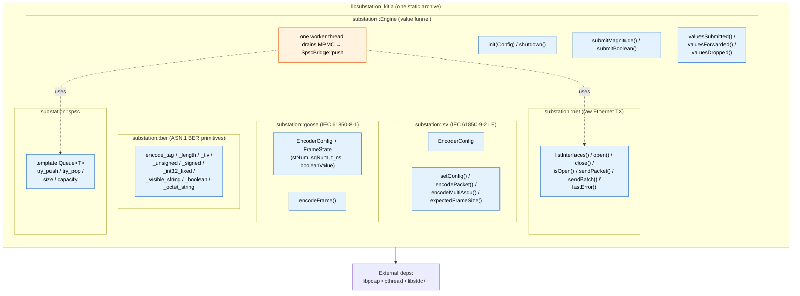
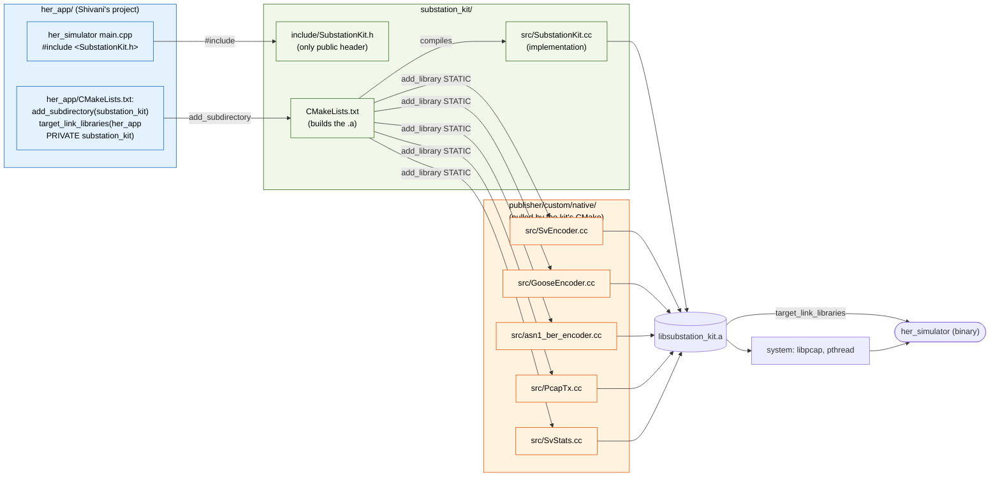
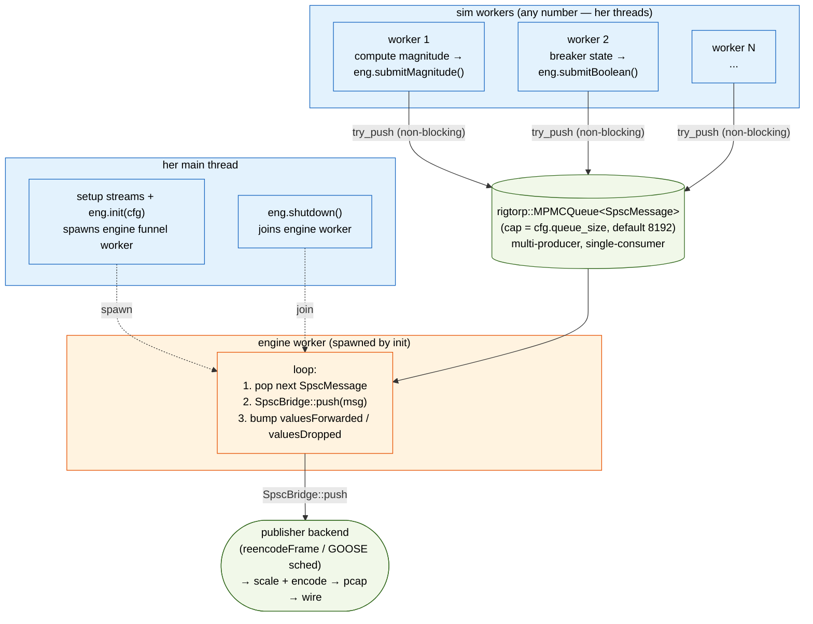
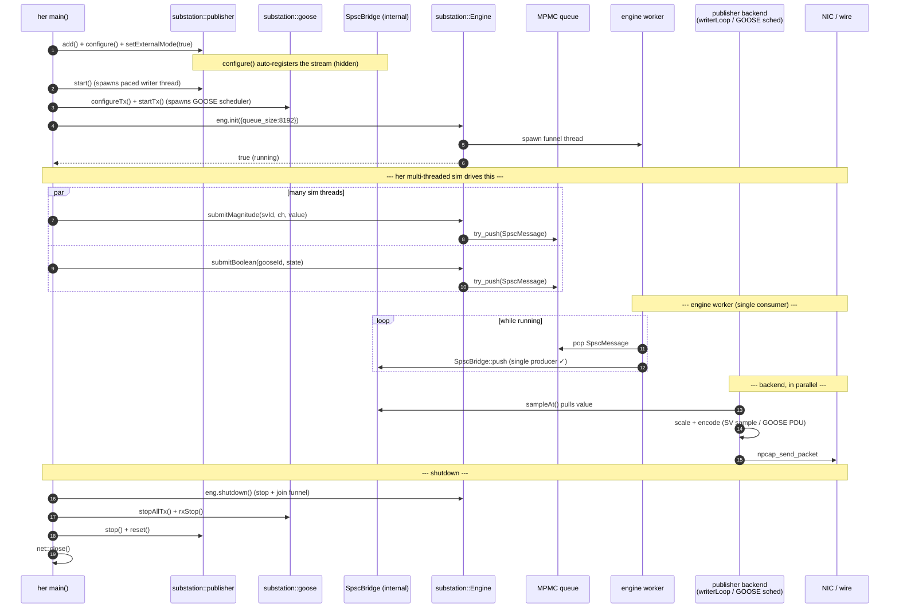

# SubstationKit — embeddable IEC 61850 publisher library

Hand this folder to Shivani. She drops it into her C++ project, links it,
and gets the full publisher backend's powers from her own `main()`.

## Folder layout

```
substation_kit/
├── include/SubstationKit.h        ← her ONLY #include
├── src/SubstationKit.cc            ← library implementation
├── example/sim_example.cpp         ← runnable starter
├── CMakeLists.txt                  ← build it as a static library
└── README.md                       ← this file
```

## What the library gives her

Everything sits in C++ namespace `substation::`. Nothing leaks into her code.

| Namespace | What it does | Source |
|---|---|---|
| `substation::Engine` | Thread-safe MPMC **value funnel** — collapses her many producer threads into the single producer the SpscBridge requires | `SubstationKit.cc` |
| `substation::publisher::*` | Full multi-publisher SV path (live magnitude → scaled IEC sample → wire) | wraps `PublisherController` |
| `substation::goose::*` | GOOSE encode + TX/RX lifecycle (retransmit ramp) + `popDecoded` for RX | wraps `GooseService` |
| `substation::sv::*` | IEC 61850-9-2 LE SV encoder (low-level, if she builds frames herself) | wraps `sv_encoder.h` |
| `substation::ber::*` | ASN.1 BER primitive encoders | wraps `asn1_ber_encoder.h` |
| `substation::net::*` | Raw Ethernet TX via libpcap / AF_PACKET | wraps `PcapTx.h` |
| `substation::spsc::Queue<T>` | Lock-free SPSC ring (rigtorp) for her own thread handoffs | wraps `rigtorp::SPSCQueue` |

The library is **self-contained**. It embeds the publisher backend it needs
(multi-publisher controller, SV/GOOSE encoders, SPSC bridge, ASN.1 BER,
libpcap TX, stats) and links libpcap + pthread. No Tauri, no Rust, no
uWebSockets, no Node — the **WebSocket transport is her app's concern**, not
this library's.

## Minimum example (what she copies into `main()`)

```cpp
#include <SubstationKit.h>

int main() {
    // 1. Raw TX socket (shared by SV + GOOSE backends).
    substation::net::open("enp1s0");

    // 2. An External (live) SV stream — push magnitudes, backend scales+encodes.
    uint32_t sv = substation::publisher::add();
    substation::publisher::Config pc{};        // svID, rate, channels, types...
    substation::publisher::configure(sv, pc);  // auto-registers the stream
    substation::publisher::setExternalMode(sv, true);
    substation::publisher::start();            // spawns the paced writer thread

    // 3. The value funnel — safe for many of her threads to push concurrently.
    substation::Engine eng;
    eng.init(substation::Engine::Config{ /*queue_size*/ 8192 });

    // ... her simulator threads call, whenever they produce a value:
    eng.submitMagnitude((uint16_t)sv, /*channel*/ 0, 230.5f);

    // 4. Teardown.
    eng.shutdown();
    substation::publisher::stop();
    substation::publisher::reset();
    substation::net::close();
}
```

`init()` does nothing automatic; `shutdown()` is also called by the
destructor if she forgets, so it's RAII-safe.

## Build options

### Option 1 — CMake (recommended, three lines in her CMakeLists.txt)

```cmake
add_subdirectory(substation_kit)
target_link_libraries(your_simulator PRIVATE substation_kit)
target_include_directories(your_simulator PRIVATE substation_kit/include)
```

That's it. The kit's `CMakeLists.txt` collects all the publisher backend
source files it needs.

### Option 2 — Plain `g++` (zero build system)

For a one-file simulator she just compiles directly:

```bash
g++ -std=c++17 -O2 \
    your_sim.cpp \
    substation_kit/src/SubstationKit.cc \
    publisher/custom/native/src/asn1_ber_encoder.cc \
    publisher/custom/native/src/SvEncoder.cc \
    publisher/custom/native/src/SvStats.cc \
    publisher/custom/native/src/GooseEncoder.cc \
    publisher/custom/native/src/GooseTxScheduler.cc \
    publisher/custom/native/src/GooseReceiver.cc \
    publisher/custom/native/src/GooseService.cc \
    publisher/custom/native/src/SpscBridge.cc \
    publisher/custom/native/src/PublisherController.cc \
    publisher/custom/native/src/SharedBuffer.cc \
    publisher/custom/native/src/sv_publisher_instance.cc \
    publisher/custom/native/src/equation_processor.cc \
    publisher/custom/native/src/fault_injector.cc \
    publisher/custom/native/src/cid_generator.cc \
    publisher/custom/native/src/PcapTx.cc \
    -Isubstation_kit/include \
    -Ipublisher/custom/native/include \
    -Ipublisher/custom/native/src \
    -lpcap -lpthread \
    -o your_sim
```

### Capabilities (Linux)

Raw Ethernet TX needs caps; same as the standalone publisher:

```bash
sudo setcap cap_net_raw,cap_net_admin+eip ./your_sim
```

(Re-run after every rebuild — caps are stripped when the binary is replaced.)

## Threading contract (very important)

Read this once and remember:

| Object | Where she can call from |
|---|---|
| `substation::Engine` `init`/`shutdown` | Main thread only (or any one thread). Not thread-safe to start/stop concurrently. |
| `engine.submitMagnitude(...)` / `submitBoolean(...)` | **Any** number of threads. The MPMC queue is multi-producer. |
| `substation::publisher::*` / `goose::*` lifecycle | Main/setup thread. Call once during setup, not from hot paths. Configuring a stream auto-registers it internally. |
| `substation::goose::popDecoded` | One consumer thread per stream (drains decoded RX booleans). |
| `substation::ber::*` | Thread-safe; stateless. |
| `substation::net::*` | Single-handle; one thread for TX. The backend writer owns it after start. |
| `substation::spsc::Queue<T>` | One producer thread + one consumer thread per instance. |

The whole point of the Engine is that her **many** sim threads can push
values concurrently; the Engine's single worker is the lone producer to the
SPSC bridge, so the SPSC single-producer rule is never violated.

## Architecture diagrams

### L1 — What's inside `libsubstation_kit.a`

Everything sits in `namespace substation::` and never collides with her code.



### L2 — How her app integrates with the library

Two files are all she touches: `SubstationKit.h` (include) and her
project's `CMakeLists.txt` (link). The kit pulls the publisher's native
sources in **transparently** via its own `CMakeLists.txt` — she does not
add publisher sources to her own build.



### L3 — Threading model when `Engine` is used

Three roles. `Engine::init()` spawns one **engine worker** thread that
owns the libpcap handle. Her code stays free to fan out into as many
"sim worker" threads as it wants — they push into a multi-producer
queue.



### L4 — Typical usage sequence (one full lifecycle)

What her code does in temporal order: open TX → set up streams → start
backend → init the funnel → her threads push **values** → shutdown. The
Engine never touches frame bytes; the publisher/GOOSE backend encodes and
transmits.



### Bare-bones threading topology (text)

```
   main thread        her sim worker(s)        engine funnel worker      backend writer/sched
   ┌─────────┐        ┌──────────────┐         ┌──────────────────┐      ┌────────────────────┐
   │ setup   │─spawn─▶│              │         │                  │      │ writerLoop (SV)    │
   │ streams │        │ submit       │──push──▶│ MPMC → SpscBridge│──┐   │ reencodeFrame      │
   │ + funnel│        │ Magnitude/   │         │   (1 producer)   │  └──▶│  scale + encode    │──▶ NIC
   │         │        │ Boolean      │         └──────────────────┘      │ GooseTxScheduler   │
   │ shutdown│─join──▶│              │                                   └────────────────────┘
   └─────────┘        └──────────────┘
```

Many sim workers push **values** in parallel (MPMC, lock-free). The engine's
single worker drains them into the per-stream SPSC bridge — satisfying its
single-producer contract — and the publisher/GOOSE backend does the actual
magnitude→sample scaling, encoding, pacing, and transmission.

## Stats she can poll

```cpp
engine.valuesSubmitted();   // total values accepted into the MPMC queue
engine.valuesForwarded();   // drained + pushed to the SpscBridge
engine.valuesDropped();     // queue full or stream unregistered (treat as drop)
```

For on-wire counts, poll the backend: `substation::publisher::` runs the SV
writer (see its controller logs / SvStats), and `substation::goose::getStats()`
returns GOOSE `txSent`/`rxPushed`.

## Common gotchas

| Symptom | Cause | Fix |
|---|---|---|
| `publisher::start()` fails / no frames on wire | iface not open or wrong | call `net::open("<nic>")` first; check `ip link show` |
| Operation not permitted | Missing caps | `sudo setcap cap_net_raw,cap_net_admin+eip ./your_sim` |
| `submitMagnitude/Boolean` returns false | MPMC full, or stream not configured | configure the stream first (auto-registers); raise `queue_size` |
| `valuesForwarded` stays 0 | stream id mismatch | the SV stream id MUST equal the `publisher::add()` id |
| Magnitude not on wire | stream not in External mode | call `publisher::setExternalMode(id, true)` before `start()` |
| GOOSE first frame delayed ~1 heartbeat | no initial value before `startTx` | push the initial boolean before `goose::startTx()` |

## API version

This is **v1**. ABI may shift between versions; pin to one commit hash
when integrating.
